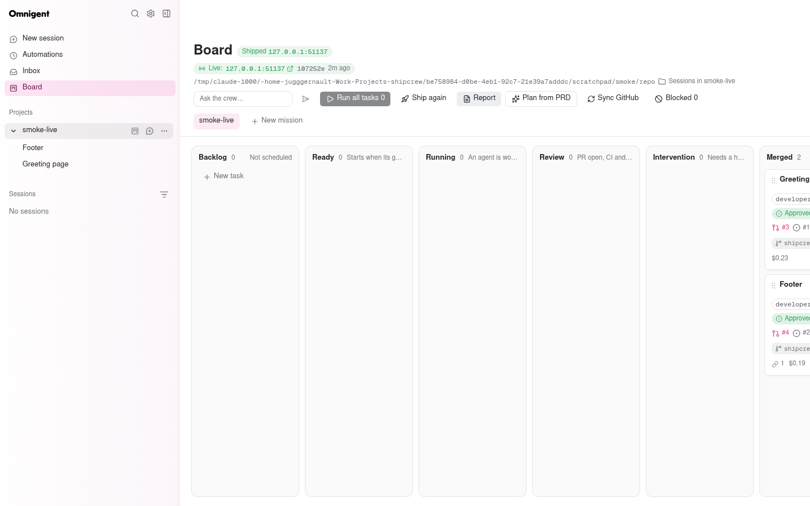
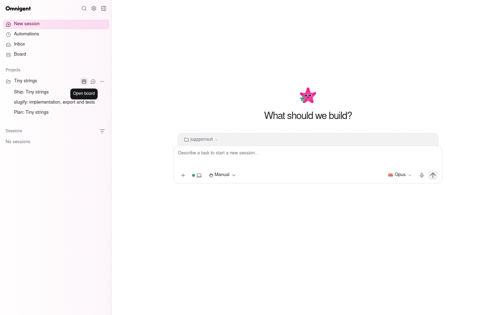
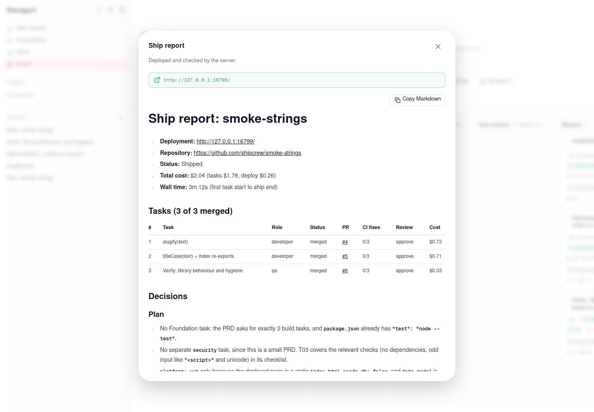
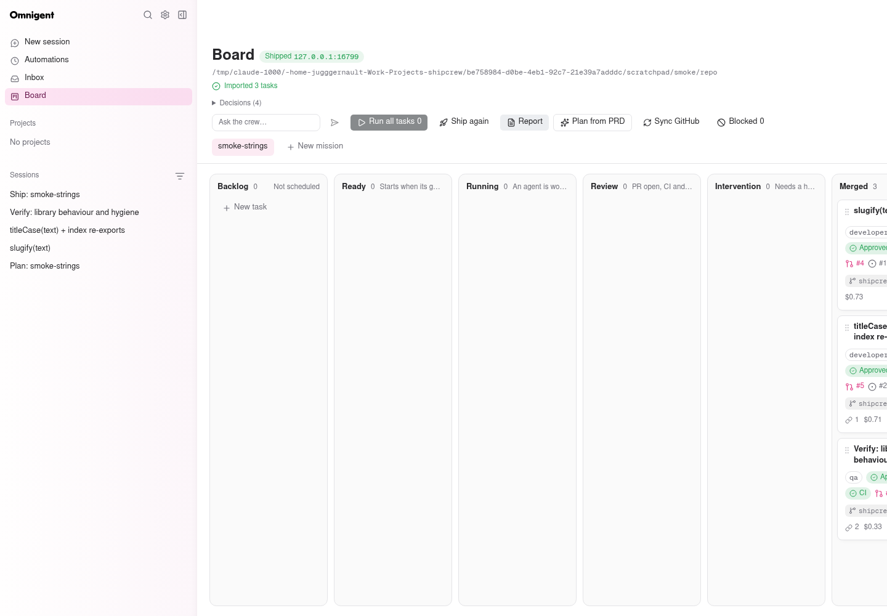
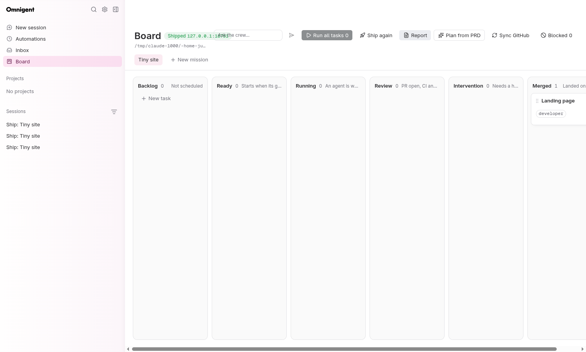
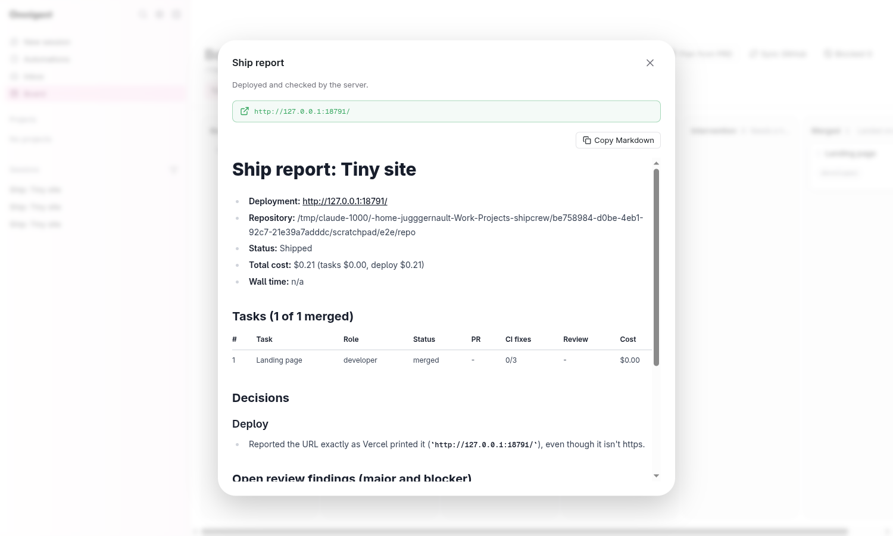

# shipcrew on omnigent: status

Fork branch `shipcrew-r9` (bundles: shipcrew `v3-r9`). Design:
`shipcrew/PROPOSAL-v3.md`. Last live end-to-end run: 2026-09-30 (r9 smoke,
below). The dated sections after this one are the history of each round.

## Current state (round 9 integration, 2026-09-30)

`shipcrew-r9` = round 8 + deploy + headless + gitops; `v3-r9` = the matching
bundle branches. Details of each part are in the sections below.

- **Pipeline**: plan -> tasks (one worktree, branch, PR each) -> CI (the
  server installs `ci.yml`) -> fresh reviewer -> merge (push with a lease,
  stale branches updated from main before a CI fix, first-prompt retry) ->
  **live preview after every merge** -> ship (last redeploy, URL check,
  report). Alembic is one linear chain: `... sc0007ap -> sc0008ps`
  (`Task.pushed_sha`) `-> sc0008pv` (`Mission.preview`, head).
- **Deploy targets** (`omnigent/shipcrew/deploy_targets/`): `base.py` holds
  the protocol, `__init__.py` the lazy registry. Targets: `docker` (default
  under `auto` when docker answers; quick tunnel or Caddy on a VPS domain),
  `vercel` (agent target, as before) and `argocd` (server side, k3s + ArgoCD
  on a VPS, see [VPS.md](VPS.md)). `argocd.py` implements the real protocol
  (`server_side`, `DeployContext` fields, `refresh`, built as
  `Target(settings)`). The integration stub is gone. The gitops files
  (`deploy/k8s`, `gitops.yml`) are installed next to CI only when
  `SHIPCREW_DEPLOY_TARGET=argocd`, decided from `settings.deploy_target`.
  `SHIPCREW_BASE_DOMAIN` falls back to `SHIPCREW_PUBLIC_BASE_DOMAIN`.
- **Harness** (`SHIPCREW_WORKER_HARNESS=auto`): claude-sdk for planner,
  designer, scaffolder, developer, reviewer, integrator and devops.
  claude-native only for qa and security, which need the chrome-devtools MCP.
  No bundle loads the shadcn MCP any more (~265 MB per session). Builders
  add components with `pnpm dlx shadcn@latest add <c> --yes` or `npx
  shadcn@latest add <c> --yes`. That is the only shadcn form on the builder
  and scaffolder allowlists (no `--cwd`, `--path`, `--overwrite` or `--all`).
  Auto capacity, parked idle developers and the headless browser are
  unchanged ([RESOURCES.md](RESOURCES.md)).
- **Bundles (v3-r9)**: COMMON stays lean (8.0 KB): round 8's "Keep the app
  light" section and merge-not-rebase rule, headless Playwright only, and the
  shadcn CLI rule. The planner and scaffolder carry the deployable Foundation
  (`Dockerfile`, `.dockerignore`, `output: "standalone"`). Devops runs only
  for agent targets. validate_agents: 267 cases per bundle, plus 261 in the
  sdk rendering.
- **Local e2e without anything public**: with `SHIPCREW_SHIP_ALLOW_PRIVATE_URLS=1`
  the tunnel exposure also accepts a loopback URL printed by a fake
  `cloudflared` (`SHIPCREW_CLOUDFLARED`).

### r9 smoke (port 16831, own state dir, real docker, fake gh + fake cloudflared, real Claude)

A plain node repo (`server.js` + `lib/page.js`, `node --test`, no Dockerfile,
so the `Dockerfile.node` fallback was used). Two developer tasks, the second
depending on the first, with `auto_run` + `auto_ship` and
`SHIPCREW_DOCKER_BUILD_NETWORK=host`.

- The first merge happened at 14:25:35. By 14:25:45 the preview was `live` at
  `http://127.0.0.1:51137`, serving `v1`.
- The second merge happened at 14:27:05. The ship redeployed it, and by
  14:27:10 the preview had the new sha on the **same URL**, serving `v2` plus
  the footer. The ship ended `done` with the report: Live since, Last deploy
  (docker, build 5 s, image 61.3 MB), 2/2 merged, $0.42, 3 min 05 s wall
  time, 0 interventions.
- Both developer sessions ran on `claude-sdk`, and so did the reviewers.
- `DELETE /preview` afterwards: no container, image, tunnel or forwarder left.



### Checks (r9)

ruff + format, `pyrefly check` (0 errors), pre-commit on every changed file.
`pytest tests/shipcrew tests/server/test_shipcrew_mount.py`: 1103 passed.
Upstream tests next to the touched files (claude-native hook/bridge,
claude-sdk harness/executor/spawn env, session policy/relay/elicitation
routes, `tests/policies`, the shipcrew child runner): 1604 passed. Web:
lint, type-check and build are green. vitest on `src/board`,
`src/pages/BoardPage*` and `src/shell`: 3069 passed, 2 expected fail.
`build_agents.py --check` and `validate_agents.py` (all 10 bundles valid)
both pass.

### Open issues

- `shadcn add` can install packages (for example `radix-ui`), and that is
  not modelled as a `package.json` write. A feature task adding a component
  whose dependency the Foundation did not install can therefore race on the
  lockfile. The integrator resolves it at merge time.
- The argocd target is covered by unit tests with a fake kubectl, and by
  gitops' own k3d proof. It has not been re-run live after the rewrite onto
  `base.py`. A preview deploy through argocd waits for GitHub Actions and
  ArgoCD (up to `SHIPCREW_ARGOCD_WAIT_S`) while holding the mission's
  preview lock.
- Earlier known gaps stand: the first-turn retry is in memory, the stale
  branch update happens outside the merge lock, and `CanvasPage.test.tsx`
  failures predate this round and were not in scope.

## Deploy without Vercel: docker target, live URL from the first merge (2026-09-30)

Branch `shipcrew-deploy` (bundles: shipcrew `v3-deploy`). The app is
containerized and run by the server itself, deterministically (no agent, no
approval), and gets a public HTTPS URL with no account and no key. The URL
exists as soon as Foundation merges and follows every later merge.

- **Deploy targets** (`omnigent/shipcrew/deploy_targets/`): `base.py` is the
  interface (`DeployTarget`: `name`, `server_side`, `preflight() -> str|None`,
  `deploy(DeployContext) -> DeployResult(url, note, detail)`, `refresh(mission)
  -> url|None`, `teardown(mission)`; `DeployContext` = mission id, slug,
  title, repo path/url, commit sha, clean detached worktree of `origin/main`,
  `final`; `DeployError(kept_previous=)`), `__init__.py` the registry
  (`TARGETS` name -> `module:Class`, lazily imported, so `argocd.py` only has
  to exist). `SHIPCREW_DEPLOY_TARGET` = `auto` (default from the env: docker
  when `docker info` answers, else vercel when logged in, else docker, whose
  preflight says what is missing) | `docker` | `vercel` | `argocd`. A
  directly built `ShipcrewSettings` keeps `vercel` (tests, embedders: no side
  effect). The `vercel` target is the round 4 ship moved as is (agent target:
  `agent_role = devops`, `agent_prompt`, same preflight, prompt, reply parser;
  `ship.py` re-exports the old names).
- **docker target** (`docker.py`, server-side): builds
  `shipcrew/<slug>:<sha12>` (slug = `<repo-name>-<mission id 6>`, one DNS
  label) from the worktree with the repo's `Dockerfile` (a repo without one
  gets `templates/Dockerfile.node` + `templates/dockerignore`, with a note);
  runs `shipcrew-<slug>-next` with `--restart unless-stopped --memory 384m
  --cpus 1 --pids-limit 256` on a free `127.0.0.1` port; waits for `GET /` <
  400 (`SHIPCREW_DEPLOY_HEALTH_TIMEOUT_S`, 90); then routes the public URL to
  it, removes the old `shipcrew-<slug>` and renames the new one to it. An
  unhealthy or failed build is removed and the old container keeps serving.
  Keeps 2 images per mission. The same commit already running and healthy
  skips the build. State in `SHIPCREW_DEPLOY_STATE_DIR`
  (`~/.local/state/shipcrew/deploy/<slug>/`).
- **Public URL, tunnel mode (default)** (`expose.py`, `forward.py`): per
  mission a detached stdlib TCP forwarder on a stable front port (reads the
  current container port from a file on every connection) and one Cloudflare
  quick tunnel `cloudflared tunnel --no-autoupdate --url
  http://127.0.0.1:<front>` (no account, no key) whose
  `https://<random>.trycloudflare.com` is parsed from its log. A swap only
  rewrites the upstream file: the URL lives as long as the tunnel process.
  Both run in their own session (they outlive a server restart and are
  adopted again by pid + command line from their state file) and are
  supervised: `refresh` (every 15 s per live mission) restarts a dead one; a
  restarted tunnel gets a new URL, stored and pushed to the board.
- **Public URL, VPS mode**: `SHIPCREW_PUBLIC_BASE_DOMAIN=<vps-ip>.sslip.io`
  (sslip.io / nip.io: free wildcard DNS by IP, no account) serves
  `https://<slug>.<domain>` through Caddy (automatic Let's Encrypt): one
  snippet per mission `<SHIPCREW_CADDY_SITES_DIR>/<slug>.caddy`
  (`reverse_proxy 127.0.0.1:<container port>`, rewritten on each swap), then
  `caddy reload --config $SHIPCREW_CADDYFILE --adapter caddyfile`. Caddy is
  installed by the VPS script, not by shipcrew; its Caddyfile must
  `import <sites dir>/*.caddy` (use a sites dir the caddy user can read,
  e.g. `SHIPCREW_CADDY_SITES_DIR=/etc/caddy/shipcrew` owned by the server
  user). Without a caddy binary the target falls back to quick tunnels (logged).
- **Mission preview** (`omnigent/shipcrew/preview.py`, migration `sc0008pv`,
  `Mission.preview` JSON, API `preview {status idle|deploying|live|failed,
  url, sha, updated_at, live_since, error, target, deploying_sha}`): each
  scheduler tick (after the merges, before the ship) a server-side target
  deploys `main` when the set of merged tasks changed: the FIRST merge
  (Foundation) deploys at once, later ones after `SHIPCREW_PREVIEW_DEBOUNCE_S`
  (20 s, restarted by each merge: a burst deploys once). One deploy at a
  time per mission (lock + in-flight task), `SHIPCREW_DEPLOY_PARALLEL` (2)
  builds across missions. The public URL is verified by the server
  (`verify_url`, same rules as the ship) before `live`. A failed redeploy
  stays `live` on the old version with `error` set; no retry loop (the next
  merge, `POST /missions/{id}/preview` or the ship retries).
  `DELETE /missions/{id}/preview` tears everything down (containers, images,
  tunnel, forwarder, Caddy snippet) and stops redeploys; `POST` resumes.
  Restart-safe: `merged_key` is written only when a deploy ends, so a deploy
  cut off by a restart runs again. `SHIPCREW_PREVIEW=0` turns it off.
- **Ship stage**: for a server-side target no devops session and no devops
  bundle: `ship.start` -> `preview.deploy_now(final=True)` (the last
  redeploy) -> `verifying` -> report. A restart with `ship.status=deploying`
  simply runs it again. The report adds `Live since: <first deploy>`, and
  `Last deploy: <target>, commit, build/start/deploy time, image MB`. The
  vercel target is unchanged.
- **Board**: `LivePreviewChip` under the mission title: `Live: <host>` (new
  tab), deployed sha, "4m ago" (title: live since, deploy time, target);
  spinner + `deploying <sha>…` during a redeploy; "last deploy failed" when
  the old version still serves; "Deploying the first version…" before the
  first URL. Missions poll while a preview deploys (SSE `mission.updated`
  otherwise).
- **Tools** (`tools.py`): `CLOUDFLARED` (`python -m omnigent.shipcrew.tools
  --fix` downloads the official static binary from GitHub releases
  (`cloudflared-linux-<arch>`, ELF-checked) to `~/.local/bin`, like gh),
  `CADDY` (optional, resolved only), `DOCKER` (required for the docker
  target), `VERCEL` required only for `SHIPCREW_DEPLOY_TARGET=vercel`. Env
  overrides `SHIPCREW_DOCKER`, `SHIPCREW_CLOUDFLARED`, `SHIPCREW_CADDY`.
- **Bundles** (shipcrew `v3-deploy`): scaffolder step 8 writes exactly two
  deploy files, `Dockerfile` (verbatim: multi-stage, Next.js standalone on
  bare `alpine:3.22` + the node binary + libstdc++, non-root uid 10001, no
  npm / dev dependencies / source maps, HEALTHCHECK) and `.dockerignore`, and
  sets `output: "standalone"`; runtime deps only in `dependencies`; never
  runs docker. Planner: Foundation is the first deploy (build passes, `/`
  renders the real shell, no env var needed; owns `Dockerfile`,
  `.dockerignore`); no deploy task. devops: only for agent targets.
- **CI template** (`templates/ci.yml`): the build step appends the Next.js
  first-load JS shared by all routes (gzip of `rootMainFiles` in
  `.next/build-manifest.json`) to the job summary; a `docker build + image
  size budget` step (when a Dockerfile exists) builds the production image,
  reports its size and WARNS above `vars.SHIPCREW_IMAGE_BUDGET_MB` (200).
  Warn, not fail, by default: a red check spends the task's 3 CI-fix
  attempts and parks the card on a human for a weight regression, the
  opposite of zero-human; `vars.SHIPCREW_IMAGE_BUDGET_ENFORCE=1` fails
  instead.

### Verified for real (docker 29 + a real quick tunnel, this machine)

The built demo `shipcrew-demo-web-4` (Next.js 16 polls app, pnpm) copied to a
scratch dir, the scaffolder's Dockerfile + .dockerignore added,
`output: "standalone"`; a script calls `DockerTarget.deploy` twice (two
commits) then `teardown`:

- first deploy: `https://closure-schools-rentals-evaluation.trycloudflare.com`,
  public `GET /` 200 (13 kB, title "Mini-sondages"), public `GET /api/polls`
  200 `application/json` with the seeded polls. Build 1.1 s (layer cache of
  an earlier build of the same Dockerfile), container healthy 0.8 s after
  `docker run`, tunnel URL printed 6.7 s after start, first public 200 19.9 s
  after that (edge DNS).
- second deploy (source changed, install layer cached): build 73.6 s, start
  0.8 s, **same URL** after the swap, public `/` 200 on the new commit, one
  container left.
- cold build (nothing cached, npm registry at ~40 kB/s here): 8 min 13 s,
  almost all `pnpm install`.
- image: 66.1 MB compressed (containerd store `Size`), ~185 MB unpacked
  (`docker images`: 251 MB incl. content): alpine 9 MB + libstdc++ 3 MB +
  node binary 129 MB + traced app 43 MB (next 17 MB, sharp/libvips 18 MB).
  The node binary is the floor: < 150 MB unpacked is not reachable with
  Node; the budget is 200 MB.
- idle container: 42.5 MiB of the 384 MiB limit, 0 % CPU.
- teardown: no container, image, tunnel or forwarder left.

On this machine the docker bridge network timed out on registry.npmjs.org
during `docker build` (ETIMEDOUT) while the host network worked:
`SHIPCREW_DOCKER_BUILD_NETWORK=host` passes `--network host` to the build.
Docker 29 here has no buildx: the legacy builder builds the multi-stage file.

### Checks (deploy)

`uv run ruff check omnigent/shipcrew tests/shipcrew` and `ruff format`,
`uv run pyrefly check` (0 errors), `uv run pytest tests/shipcrew
tests/server/test_shipcrew_mount.py tests/server/test_shipcrew_child_runner.py
tests/test_native_policy_hook.py tests/test_claude_native_bridge.py`: 1494
passed (new: `test_deploy_docker.py` 21 with fake docker / cloudflared /
caddy executables whose containers are real HTTP servers, `test_preview.py`
13). Web: `npm run lint`, `type-check`, `build` green; `vitest run
src/board src/pages/Board*` 14 files green (new `MissionPreview.test.tsx`,
9); `src/pages/CanvasPage.test.tsx` fails the same 18 tests on the base
commit (environment, not this change). Bundles: `build_agents.py --check`,
`validate_agents.py`: 10 bundles valid.

### Known gaps (deploy)

- Quick tunnels are Cloudflare's no-SLA testing tunnels: a restarted tunnel
  (reboot, crash) gets a new random URL (stored and shown, but links shared
  earlier die). VPS mode with a domain gives a stable URL.
- The ship stage's `ship_url` follows a new tunnel URL only for a finished
  ship (`done`); the preview is the source of truth.
- A restart during a build leaves a half-built image layer cache and a
  `-next` container at most (removed by the next deploy).
- Several missions share the host's Docker: CPU/memory limits are per
  container, builds are capped by `SHIPCREW_DEPLOY_PARALLEL`.
- A new `sc0008pv` head: parallel rounds adding their own revision must
  rechain `down_revision`.

## Round 8: the last live-run-4 interventions (2026-09-30)

Branch `shipcrew-round8` (bundles: shipcrew `v3-round8`). Live run 4 shipped
in 36 min, 6/6 merged, QA passed first try, with 3 human interventions.

- **Push with a lease** (`pr_loop._sync_branch`, `Task.pushed_sha`, migration
  `sc0008ps`): a developer that rebased its branch in a CI-fix turn made the
  plain push fail (non-fast-forward). The loop pushes only its own task branch
  (`shipcrew/<id8>-<slug>`, `_unsafe_push_branch` refuses anything else) with
  `--force-with-lease=refs/heads/<branch>:<sha it last pushed or followed>`:
  a rewritten branch replaces the PR head; a human push since then fails the
  lease and holds the card ("the PR branch moved on GitHub since shipcrew
  last pushed it ... someone else pushed to it").
- **Stale branch before a CI fix** (`pr_loop._ci_red`, `_behind_base`): on red
  CI, when `origin/main` has commits the branch lacks (live: a sibling's
  merge replaced the Foundation stub answering 501), the loop runs `gh pr
  update-branch` (a conflict starts the integrator), follows the new head and
  re-runs CI; only a red CI on an up-to-date branch sends the logs and counts
  a fix attempt.
- **First-turn retry** (`OmnigentSessionService._retry_first_turn`,
  `SessionSnapshot.error_code`): a session's first prompt is kept until the
  agent answers; a `failed` snapshot with `last_task_error.code ==
  "runner_error"` and no agent item (live: the planner's "turn failed (status
  204)", a duplicate-delivery race right after create) re-sends it once after
  2 s and reads as `running` (30 s grace for the stale failure), so
  `mission.plan` stays `running`. Covers every shipcrew first prompt (task
  root, planner, reviewer, integrator, ship). A later turn is never retried.
- **ANSI-C strings** (`policies._scan_expansions`, `_ansi_c_literal`): the
  reviewer chain `...; grep -c $'\u00a0' lib/results.ts; ...` asked as
  "substitutions, heredocs, complex expansions or unbalanced quotes" (the
  `$'..'`, not the `\|` or `--radius`). A decodable `$'..'` is re-quoted as
  its literal value, so the allowlist judges the word the shell runs (`git
  diff $'--output=x'` still asks); `\c`, NUL, an embedded quote still ask.
- **Reviewer sees Decisions** (`reviewer_prompt`): the developer's
  `Decisions:` list is in the prompt, where new dependencies are justified.
- **Bundles** (shipcrew `v3-round8`): COMMON: merge `origin/main`, never
  rebase a branch with a PR; "Keep the app light" (every dependency justified
  in `Decisions:`, built-ins first, no state/ORM/UI-kit/date/lodash libs
  unless the PRD needs them, shadcn components only when used, server
  components by default). Planner + scaffolder: API stubs answer 200 with a
  valid empty contract shape, never 501/500; minimal Foundation toolchain.
  Reviewer: an unjustified or built-in-duplicating dependency is `major` /
  `CHANGES`. COMMON rewritten tighter without dropping rules (10.7 -> 7.8 KB);
  AGENTS.md: planner 17.1 -> 12.5 KB, shipcrew 15.7 -> 12.6, scaffolder 14.7
  -> 11.4, qa 14.0 -> 11.1, reviewer 13.3 -> 10.7, security 13.3 -> 10.4,
  developer 12.7 -> 9.7, devops 12.5 -> 9.6, integrator 11.6 -> 8.7, designer
  11.6 -> 8.7. 260 validator cases per bundle (the live chain is ALLOW for
  every role).

Known gaps: the first-turn retry is in memory (a server restart in between
surfaces the failure); a stale-branch update happens outside the merge lock
(harmless, `update-branch` is idempotent); planner and orchestrator
AGENTS.md stay slightly above 12 KB.

## Headless: lighter sessions per VPS (2026-09-30)

Branch `shipcrew-headless` (bundles: shipcrew `v3-headless`). All numbers,
the guarantee table and VPS sizing are in [RESOURCES.md](RESOURCES.md).

- **Worker harness per role** (`omnigent/shipcrew/harness.py`,
  `SHIPCREW_WORKER_HARNESS=auto|native|sdk[,role=native|sdk]`).
  - The server renders the uploaded copy of a claude-native worker bundle for
    claude-sdk: `permission_mode: auto`, no `allowed_tools` / `mcp_config`.
    The bundles on disk are untouched.
  - `auto` (default): sdk for developer, reviewer, integrator and devops;
    native for designer, scaffolder, qa and security (they use the shadcn /
    chrome-devtools MCP, which the SDK path does not load).
  - Measured with 3 sessions in parallel: sdk ~300 MB per session against
    ~660 MB for native with shadcn, 6 s of CPU per turn against 14 s, idle CPU
    3 % against 7 %, and ~40 % less quota per turn.
- **Guarantees on sdk.** Kept:
  - DENY with a hint, ASK as an approval card, owned paths;
  - `--strict-mcp-config`, `--setting-sources project,local`;
  - cost reporting, interrupt and stop (a message relaunches with the
    conversation);
  - the merge-gate memory of an accepted ASK, which is new: the relay path now
    calls `approvals.notify_accepted_relay_ask` from the `approval` event /
    resolve URL through `_PendingPolicyAskWrites.policy_reason`.

  Not available on sdk: the role's own MCP servers, Claude Task sub-agents,
  and a live Claude TUI to attach to. `validate_agents.py` checks the sdk
  rendering of every worker with 250 cases each, spelled as `sys_os_*` tool
  calls; every verdict equals native.
- **Auto capacity** (`omnigent/shipcrew/resources.py`,
  `SHIPCREW_MAX_PARALLEL=auto[:ceiling]`).
  - The cap is `running + floor((MemAvailable or the cgroup headroom - reserve)
    / per-session MB)`, capped by CPUs and recomputed every tick.
  - Knobs: `SHIPCREW_MEM_RESERVE_MB` (2048), `SHIPCREW_SESSION_MB` (350 on sdk,
    700 on native).
- **Parked developers** (`SHIPCREW_PARK_IDLE_WORKERS`, default on). The
  developer is stopped once its PR is open and after each fix push. The next
  CI or review message relaunches it.
- **Headless browser.**
  - `chrome-headless-shell` is preferred when present, never downloaded:
    `scripts/shipcrew_stack.sh` exports `CHROMIUM_PATH`, and `tools.session_env`
    and the CI template's "headless browser" step pick it too. In one e2e run
    it used 220-330 MB against 480-770 MB for full Chromium.
  - COMMON: Playwright is always headless.
  - The stack script also exports `NEXT_TELEMETRY_DISABLED=1`, and
    `SHIPCREW_NODE_HEAP_MB` is an opt-in V8 heap cap.

Upstream footprint added (all marked `shipcrew fork`):

- `_sessions/common.py`: a `policy_reason` field;
- `_sessions/orchestration.py`: 2 lines filling it;
- `routes_events.py` and `routes_elicitations.py`: +4 lines each, the hook
  call.

## Round 7: refuse with a hint, ask only for real decisions (2026-09-30)

Branch `shipcrew-round7` (bundles: shipcrew `v3-round7`). Live run 3 shipped
in 40 min, 7/7 merged, with 14 approvals. Principle: ASK only when a human
decision is genuinely needed; a command refused only because the agent chose
the wrong tool or crossed into another task's files is DENY with an actionable
hint (the guardrail message reaches the agent, it corrects itself).

- **Complex in-place edits refused with a hint** (`policies.shell_allowlist`,
  `_safe_sed_script`): for a role with `@sed:sed_in_place` / `@perl:perl_in_place`,
  a `sed -i` / `perl -pi` that is not ONE simple `s///` (regex addresses
  `/re/d`, `/re/,+1d`, several commands or `-e`, `a`/`i`/`c`, a newline or
  `\n` in the replacement, `-i.bak`, `-f`, `w`/`e`, a `$VAR`) is DENY: "Edit
  files with the Edit tool (it only needs the file to be in your owned
  paths); sed -i is only for one simple s/// substitution". A simple
  substitution stays ALLOW (owned paths judge the file); read-only roles
  still ASK; an unanalyzable command (`$(..)`) still ASKs.
- **Another task's files refused with a hint** (`policies.owned_paths(other_tasks=)`,
  `sessions.inject_task_contract(other_tasks=)`, `service._other_active_tasks`):
  at start the server injects the mission's other ready / running / review /
  intervention tasks (title + owned paths, a start-time snapshot) into the
  new `# @task.other_tasks` slot. A write to a file one of them owns (and this
  task does not) is DENY: "`<path>` belongs to task '<title>' (in progress).
  Do not edit it; work against the shared contract (e.g. lib/api-client.ts,
  lib/db.ts) and mock it in your tests; if the contract lacks something, say
  so in your final reply." A DENY target wins over an ASK one in the same
  command; a file nobody else owns still asks.
- **Inherited tests** (`omnigent/shipcrew/inherited_tests.py`,
  `service._grant_inherited_tests`): at start the task is granted (added to
  its `owned_paths`) every test file on the base ref (`test/**`, `tests/**`,
  `e2e/**`, `**/*.test.*`, `**/*.spec.*`) whose app imports (relative, `@/` /
  `~/`, bare `lib/x`-style; `import`/`export from`/`require`/`import()`) are
  ALL modules it owns. Conservative: no app import (a URL-only e2e spec), one
  non-owned module, or a test another active task owns, and it is not
  granted. Fixes live runs where `test/foundation-api.test.ts` /
  `e2e/foundation.spec.ts` pinned stub behaviour (2 approvals + 2 merge holds).
- **Merge-gate memory** (`approvals.py`, `routes_hooks._notify_shipcrew_approval`,
  `store.add_approved_paths`, migration `sc0007ap`): when a human accepts an
  owned-paths ASK in a task's root session, the claude-native hook route
  calls `app.state.shipcrew_approval_hook`; the paths named by the policy
  reason ("`x` is outside this task's owned paths" / "is a shared contract
  file") go to `Task.approved_paths`, and the PR loop's
  `paths_outside_owned` hold skips them. APPROVALS.md rules still hold.
- **Package-manager output flags** (`_strip_pm_output_flags` in
  `_normalize_program`): `-s`/`--silent`, `--loglevel <x>`, `--reporter=<x>`,
  `--color`/`--no-color` and (outside dependency commands) `-w`/
  `--workspace-root` are dropped before the subcommand and after `run`:
  `pnpm -s lint`, `npm run --silent typecheck`, `pnpm -s run test` match the
  plain entries; the stopgap `-s` entries left `dev_tools` / `test_runners`.
  `pnpm -s add x` = `pnpm add x`; `pnpm -w add x` / `npm -w web install x` are
  now modelled as `package.json` writes (`_pm_subcommand`).
- **Bundles** (shipcrew `v3-round7`): COMMON: another task's file is DENY (work
  against the contract, mock it), inherited tests, Edit tool over any
  non-trivial `sed -i`, every user-supplied text field of an API route has an
  explicit max length + 400 above it + a unit test, every Next.js app ships
  `app/icon.svg`. Planner + scaffolder: Foundation tests are shell / contract
  smoke tests only, never on a stub route or page another task owns. qa /
  security: input size limit checked on EVERY text field (10 000 chars ->
  400, else `major`). Reviewer (v0.2 commit kept): trusts green CI; its
  `test_runners` has no build / e2e (`pnpm build`, `next build`, `pnpm -s
  e2e` ASK for it). 256 validator cases per bundle (240 feature contract with
  one other in-progress task + 16 Foundation).

Known gaps: the approval hook covers the claude-native ASK path (all worker
roles) only, and records the path the reason names (the first out-of-contract
target of a multi-file command); the other-tasks snapshot is not refreshed
while a session runs; inherited tests need a static import of an owned module
(URL-only e2e specs stay with their owner).

## Round 6: zero approvals for normal work (2026-09-29)

Branch `shipcrew-round6` (bundles: shipcrew `v3-round6`). Live run 2 (real
GitHub + Vercel, Next.js polls app) merged 7/7 with ~14 approval cards; every
remaining card is now an ALLOW case in `validate_agents.py` (with its role),
next to the negative cases. Kept: the DENY set, the push guard, the `.env`
ban, the CI workflow gate, owned paths, the reviewer's no-writes, verify roles
add tests only.

- **Vetted variables as arguments** (`policies.shell_allowlist`): besides
  read-only commands, a vetted name (`PORT`, `CHROMIUM_PATH`, `CI`,
  `NODE_ENV`, `HOME`, `TMPDIR`, ...) may be a plain argument of any
  allowlisted command when the command does not assign it, it is not the
  program or an option name, and the program writes no file / git state
  (`git`, `cp`/`mv`/`rm`/`mkdir`/`tee`, `sed`, `find`... still ask). The
  command is matched with the `:-` default (or a typical value) in place, so
  `sort ${X:--o/tmp/x}` is still refused. `pnpm exec next start -p
  ${PORT:-3000}`, `pkill -f "next start -p ${PORT:-3000}"` pass for qa /
  security. `${PIPESTATUS[n]}` / `$PIPESTATUS` are special parameters.
- **curl to the local app** (`curl_output_targets`, new bundle group
  `local_http` for builders, scaffolder, qa, security): localhost /
  127.0.0.1 / [::1] / 0.0.0.0, any port and method, `-H`, inline `-d`, `-w`,
  `-s`, `-i`; `-o FILE` is a write target (owned paths / test writes judge it,
  also when the URL holds an unexpanded `$PORT`); file reads (`-d @f`, `-T`,
  `-F f=@f`, `-H @f`) only for a relative path inside the cwd that is no
  `.env*`. Refused: other hosts, `-K`, `-c`, `-D`, `--trace`, `-O`, proxies,
  unix sockets, `--resolve`, `-n`, unknown options.
- **sed as a pipe filter** (`@sed:sed_filter` in `read_only`): stdin only, no
  file operand, no `-i`/`-f`/`-s`; `s` (no `w`/`e` flag), `y`, `p d q =`...,
  blocks and addresses; no `r R w W e a i c`; a delimiter inside a bracket
  expression is refused.
- **Manifest companions**: owning `package.json` by name also owns
  `pnpm-workspace.yaml`, `.npmrc`, `.nvmrc`, `.node-version` next to it (live
  guard and the PR loop's `paths_outside_owned`).
- **Agent notes never committed** (`omnigent/shipcrew/worktree_prep.py`):
  before a session starts in a task / ship / reviewer / integrator worktree,
  `/AGENTS.md` and `/CLAUDE.md` go into the repo's `info/exclude` (`git
  rev-parse --git-path info/exclude`, shared by all worktrees) unless the repo
  tracks them (Next 16 `next dev` / `next build` write them).
- **Loop children seeded** (`prepare_worktree`, `deps_seed.seed_node_modules(
  fallbacks=)`): reviewer and integrator workspaces go through the same
  preparation as task worktrees in `PrLoop._start_child`; the reviewer's
  checkout falls back to the task worktree's `node_modules` (same head, same
  lockfile) when the main checkout's does not match. A running main-checkout
  install is waited for (90 s) and never copied half-written.
- **Child interventions counted** (`SessionSnapshot.pending_ask_id`,
  `store.record_intervention`, `pr_loop._note_child_ask`): a reviewer or
  integrator ask is recorded on the task once per `elicitation_id` (reason
  `reviewer: <policy>: <preview>`, `role` field; the card stays in Review);
  the report's summary counts them ("n in reviewer/integrator sessions") and
  each entry shows the role.
- **Fix tasks fix cheap minors** (`verify.py`): a fix task owns the files of
  every finding (minor included) and its body asks to fix minor findings when
  cheap (a missing favicon).
- **Bundles** (shipcrew `v3-round6`): COMMON: Edit/Write tools instead of
  `sed -i` with complex regexes, the vetted-variable rule, `NO_COLOR=1` /
  `--reporter=dot` instead of stripping ANSI, Playwright's `webServer` rather
  than a hand-started server and curl (last resort). qa / security ROLE:
  demo script through the Playwright suite, security items as route-handler
  unit tests. developer ROLE: a `Fix:` task also fixes cheap minor findings.
  228 validator cases per bundle (215 feature contract + 13 Foundation).

Known gaps: a devops (ship) session ask is still not in the report; a
reviewer/integrator ask still does not move the card (it is only counted);
the agent-notes exclude covers the repo root only (`app/AGENTS.md` would be a
real file).

## Round 5: zero approvals for safe work (2026-09-29)

Branch `shipcrew-round4` (bundles: shipcrew `v3-round4`). Driven by the
approval cards of a live autonomous run (Next.js app, real GitHub). Goal: no
card for normal development, every real protection kept (no push, no remote
writes, no `.env` reads, owned paths, CI workflow edits gated, reviewer
read-only, verify roles test-only, the DENY set).

- **Shell allowlist** (`policies.py`): `$?` `$#` `$$` `$!` always pass.
  `$VAR` / `${VAR}` / `${VAR:-lit}` are parsed (`parse_command(params=True)`,
  words marked) and pass only in an expansion-safe read-only command (the
  bundle's new `read_only:` list; entries with a `!banned` option, a glob
  word, or `cd`/`printf`/`find`/`sed`/`jq`... are not safe) and only for vetted
  names (env-allow names, `HOME PWD USER PATH TMPDIR ...`, or assigned earlier
  in the command): `echo $DATABASE_URL` and `X=--output=f; git diff $X` ask. A
  bare `S=/p;` of an unvetted name makes the rest of the chain read-only-only;
  `PATH`/`LD_*`/`GIT_*`/`NODE_*`/... assignments ask; a variable in a write
  target asks. `${PORT:-3000}` in a vetted env prefix passes.
  `PLAYWRIGHT_SKIP_BROWSER_DOWNLOAD` joined the env prefixes. Newlines after
  `&`/`|` no longer glue into one token (`npm ci ... &\n cat ...; wait`).
  New built-in matchers `@sed:sed_in_place` (substitution scripts only, exact
  flags) and `@perl:perl_in_place` (one code-free `s///`); both are write
  targets for owned paths and the workflows guard (`sed -ni`, `--expression=`
  now counted too). `uniq IN OUT` is a write. Bypasses closed on the way:
  `printf -v`, `rg --pre`, `git diff-tree/rev-list/shortlog --output`.
- **Owned paths**: owning `package.json` (or `pyproject.toml`) by name owns the
  lockfiles next to it (policy and the PR loop's diff check).
- **Verify roles add tests only** (`test_writes_only`): deleting, renaming away
  or truncating a test on `origin/main` (`rm`, `git rm`, `mv`/`git mv` source,
  `truncate`, `>`, a full `Write`) is DENY; `Edit`, `>>` and removing its own new
  tests pass; a removal git cannot check is refused.
- **Bundles** (shipcrew `v3-round4`): new groups `deps` (npm/pnpm install|add
  any flags but `-g`/`--prefix`/`--filter`/workspace ones; gated by owning
  `package.json`) and `fs_edit` for builders and the scaffolder; `uniq`,
  `wait` read-only. COMMON: no `; echo EXIT=$?`, no needless shell variables,
  the repo's package manager (by lockfile, never npm in a pnpm repo), the
  repo's `playwright.config`, CI is installed by the server, feature tasks never
  add dependencies (say so in `Decisions:`). Scaffolder: pnpm when no lockfile,
  scaffold in place (see below), the whole test toolchain in the Foundation,
  scripts `lint typecheck test build e2e`. Planner: Foundation owns
  `**` + `package.json` and installs every dependency; tasks own their tests.
  Verify roles: add-only rule. 189 validator cases per bundle (every live
  command above as ALLOW, a Foundation contract for the dependency and
  `git mv || mv; sed -i` cases, CI workflow writes still ASK, negatives).
- **CI installed by the server** (`omnigent/shipcrew/ci_install.py`): at the
  first task start of a mission (per-mission lock, so parallel first starts
  wait), `origin/<pr_base>` without `.github/workflows/ci.yml` gets
  `templates/ci.yml` as one `chore: shipcrew CI` commit (plumbing on a temp
  index, plain fast-forward push, one retry, local base fast-forwarded when
  clean); present -> nothing; no origin / empty remote -> skipped, retried next
  start; refused -> logged, the task starts anyway. `SHIPCREW_INSTALL_CI=0`
  turns it off. The template now detects pnpm / yarn / npm (or no
  `package.json` yet: nothing runs), runs `lint typecheck test build e2e` only
  when defined, `CHROMIUM_PATH=/usr/bin/google-chrome`, never a browser
  download.
- **No host-user settings in worker sessions** (`launch_args.py`): bundles
  declare `setting_sources: project,local`; claude-native gets
  `--setting-sources project,local`, claude-sdk
  `HARNESS_CLAUDE_SDK_SETTING_SOURCES` -> `ClaudeAgentOptions.setting_sources`
  (a `"none"` skills filter still wins). Verified with the real CLI 2.1.285 on
  the subscription: the turn answers, only built-in plugins and 18 built-in
  skills, no SessionStart hook (without the flag: 8 user plugins incl.
  ponytail/superpowers/vercel, 124 skills, 5 hooks). Bundle skills still load
  through `--plugin-dir`; since user plugin skills (`vercel:*`,
  `superpowers:*`, `shipcrew:design-lock`) are gone, `design-lock` is now
  bundled (symlink) in designer/scaffolder/developer/reviewer/qa and the ROLE
  texts no longer name plugin skills.
- **Main checkout deps** (`omnigent/shipcrew/main_deps.py`): after a merge the
  merged worktree's `node_modules` is moved into the fast-forwarded main
  checkout when the lockfiles match, else one background frozen install runs
  there (pnpm/npm/yarn/bun from the lockfile, `CI=1`, bounded by
  `SHIPCREW_MAIN_DEPS_TIMEOUT_S`, log `.git/shipcrew/deps-install.log`, stamp
  per lockfile hash; `SHIPCREW_MAIN_DEPS=0` off). Also tried at each task
  start. Later worktrees then seed via `deps_seed`.
- **Tasks own their tests** (`omnigent/shipcrew/owned_tests.py`): plan import
  (and fix tasks) add `e2e/<slug>*.spec.*`, `test(s)/<slug>*` and colocated
  `*.test.*` / `*.spec.*` / `__tests__/**` next to owned sources, never the
  repo root, idempotent.
- **One approval, not two** (`native_policy_hook.py`, `routes_hooks.py`,
  claude-native `hook.py` / `bridge.py`): an accepted guardrail ASK answers
  Claude's PreToolUse with `permissionDecision: allow`, so Claude does not
  prompt again for the same call; a plain ALLOW still defers to
  `--allowedTools`.
- **Children get their own runner** (`routes_core.py` +5, `pr_loop.py`): a
  child create inherited the parent's runner, so stopping the approved
  reviewer SIGTERMed the developer's runner ("Runner disconnected
  unexpectedly") and the card went Blocked. An explicit `host_id` now cancels
  that inheritance. The reviewer runs in a detached checkout of the PR head
  (`<repo>-worktrees/shipcrew-review-<id8>-<sha8>`, node_modules seeded,
  reused per head, removed after the verdict / skip / block / merge); the
  integrator takes the task worktree after the idle developer session is
  stopped (git allows one worktree per branch; not seen live yet).
  `service.merge_ready`: a card with green CI + approval whose developer
  session failed or vanished goes on to merge instead of Blocked.
- **One verdict nudge** (`pr_loop.py`, `verify.py`, column
  `shipcrew_tasks.verdict_nudges`, migration `sc0005vn` after `sc0004sh`): a
  turn that ends without `PASS`/`FAIL` (a declined ask, or forgotten) gets one
  automatic "continue without it, finish, end with Decisions + one verdict"
  message; a second missing verdict blocks. The count is stored before the
  send, so a restart never nudges twice.
- **Interventions say what was asked** (`sessions.ask_summary`,
  `store.update_task(intervention=...)`, `report.py`): the pending
  elicitation's `policy_name` and `content_preview` (one line, <= 120 chars,
  `KEY=`, bearer, `sk-`/`ghp_`/JWT and URL-password values masked) go into the
  `Task.interventions` entry and the card's reason (`Needs approval: <policy>:
  <preview>`, cleared when the session resumes); the report summary counts
  interventions per policy and lists `<policy>: <preview>` per entry.

Scaffolding in place: `create-next-app .` refuses a folder that already holds
`.github/`, `.shipcrew/` or `DESIGN.md` (checked with create-next-app 16.3.7:
"contains files that could conflict"), and every mission repo has them once
CI is installed. So the scaffolder now sets Next.js up directly in its
worktree (`package.json`, one `pnpm add` + one `pnpm add -D`, config files with
the Write tool, `npx shadcn@latest init -d`), never in `/tmp`.

## Projects: one mission = one omnigent project (2026-09-29)

Branch `shipcrew-projects`. Every mission owns an omnigent first-class project
(sidebar folder), so its sessions are grouped instead of a flat list, and the
project row gets an "Open board" hover action.



- **Project per mission** (`omnigent/shipcrew/projects.py`): created when the
  mission is created, lazily for older missions on the first session start
  (one lock per mission, so parallel starts create one project). Owned by the
  mission owner, created through omnigent's own `/v1/projects` API in-process
  (`OmnigentSessionService.list_projects/create_project/rename_project`). Name
  = mission title (<= 94 chars); a clash adopts an unlinked folder of that name,
  else `Title (2)`, `(3)`... Stored as `Mission.project_id` (migration
  `sc0005pj` after `sc0004sh`; one shipcrew head). Best effort: a projects
  failure logs and the session is created unfiled, never blocked.
- **Every session is filed**: planner, task root sessions, reviewer/integrator
  children and the devops ship session carry `project_id` in the multipart
  `POST /v1/sessions` metadata (upstream already accepts it). Children stay
  sub-agent sessions, so they remain nested under their parent (not listed in
  the folder). A project deleted meanwhile (404) retries the create unfiled.
- **Rename**: `PATCH /missions/{id}` accepts `title`; the project follows unless
  the new name is taken (then it keeps its old name). Nothing ever deletes a
  project; a project the user deleted is replaced on the next session start.
- **API**: `project_id` in the mission payload; `GET /missions?project_id=`;
  `GET /project-links` = `[{project_id, mission_id, title}]` of the caller's
  visible missions (same ACL as the board: other users' missions never show).
- **Sidebar** (`web/src/board/ProjectBoardButton.tsx`, `projectLinks.ts`):
  one cached `project-links` query (no retries; 404 = no shipcrew = no icons);
  a `KanbanSquare` ghost icon button (tooltip "Open board", aria-label
  "Open board for <project>") first in the project header's controls cluster,
  revealed on hover and on focus-within like "New session in project"; links
  to `/board?mission=<id>`. Label-only folders and non-mission projects get
  nothing.
- **Board**: selects the mission from `?mission=`, else `?project=<project id>`,
  else the first; the header links back to the project ("Sessions in <name>",
  `/?project=<name>`, the project-scoped composer whose sidebar row is active).

### Verified live (port 16811, own state dir, fake gh + fake vercel, real Claude)

Mission "Tiny strings" (1-feature PRD, auto run + auto ship): the project was
created with the mission; the planner, the task root, its reviewer child
(`kind=sub_agent`, hidden under its parent) and the ship session all had the
mission's `project_id`; the flat Sessions list stayed empty. Chromium
(Playwright, `/usr/bin/chromium`): the hover icon is visible on hover and on
keyboard focus (opacity 1 both), Enter opens `/board?mission=<id>`, the header
link goes back to `/?project=Tiny%20strings`. Renaming the mission renamed the
project. (The devops agent refused the fake deploy URL this time, "looks like
a stub": ship failed, unrelated to projects.)

### Known issues (projects)

- The board's header link opens the project-scoped composer; the sidebar
  folder is highlighted but not force-expanded (expansion is sidebar state).
- Missions shared with no owner (`owner_user_id` NULL, single-user) create the
  project in the single-user scope; in multi-user mode a project belongs to the
  mission owner only, so a collaborator never sees it (projects have no ACL).
- The links cache refreshes on board mission updates, window focus and every
  30 s; a mission created from another tab shows its icon after that.

## Round 4 integration: ship + verify/speed together (2026-09-29)

Branch `shipcrew-round3` = `shipcrew` + `shipcrew-ship` + `shipcrew-qaspeed`
(bundles: `v3-round3` = `v0.2` + `v3-ship` + `v3-qaspeed`). One Alembic head
(`sc0004sh`; qaspeed added no revision). Conflicts were docs, the planner
step 6 (verify rules kept, "do not plan a deploy task" kept), the README role
table and the validator case list (both sets kept: 152 cases per bundle).

Integration fixes: verify roles (qa/security) now store their `Decisions:`
list too (`VerifyLoop.after_turn`), so the report lists them; the report
dialog no longer shows typography backticks around inline code; the board
header wraps its actions instead of squeezing the status chip under the
command box.




### Verified live (port 16798, own state dir, fake gh + fake vercel, real Claude)

Tiny CommonJS repo (`node --test`) with a bare `origin`, PRD in
`.shipcrew/prd.md` (2 features), mission with `auto_run` + `auto_ship`, the
fake deployment served by `python -m http.server` on 16799
(`SHIPCREW_SHIP_ALLOW_PRIVATE_URLS=1`, fake-vercel `url` =
`http://127.0.0.1:16799/`). Nothing reached GitHub or Vercel.

1. `POST /plan`: the planner imported 3 tasks (2 developer + ONE final `qa`
   verify task with the security items folded in; no devops task) and 4 plan
   decisions. Auto run queued them.
2. slugify -> PR #4 (CI green, reviewer approve, merged), titleCase + index
   (depends on it) -> PR #5 merged, qa verify wrote tests -> PR #6
   tests-only, review skipped, merged.
3. The same tick shipped: preflight `vercel whoami`, then the devops session
   ran `whoami`, `link --yes --project smoke-strings`, `deploy --prod --yes`
   (no approval card), `DEPLOYED: http://127.0.0.1:16799/`; the server GET
   the URL (200 in the http log) -> **Shipped** ~20 s after the last merge.
   Ship worktree and branch removed.
4. Report: $2.04 total (tasks $1.78, deploy $0.26), wall time 3 min 12 s,
   task table with PR links, decisions of the plan / each task / the deploy,
   no findings, no interventions. Plan request to Shipped: ~4 min.

### Known issues (integration)

- The server caches `index.html` at start: after `pnpm --filter web build`
  the running server serves stale asset names (blank board) until restart.
- vitest on Node 26 still needs `NODE_OPTIONS=--no-experimental-webstorage`
  (see Checks): without it 1409 upstream tests fail on `localStorage`.
- All earlier round 4 gaps stand (auto ship once; devops asks only in the
  Inbox; verify PR with red CI can only end blocked; no real Vercel or
  GitHub run of the ship stage yet).

## Round 4: ship stage, report, decisions (2026-09-29)




- **Decisions** (`omnigent/shipcrew/decisions.py`): every worker role ends its
  final reply with a `Decisions:` list before the verdict (shipcrew
  `_shared/COMMON.md`). `parse_decisions` is lenient (`**Decisions:**`,
  `## Decisions`, `*`/`1.` bullets, `Decisions: none`, code fences skipped, the
  last list wins, 20 items x 300 chars) and returns `[]` when absent. The PR
  loop merges it into `Task.decisions` each time it reads a developer or
  integrator reply (dedup across fix turns); the planner's goes to
  `Mission.plan_decisions`. Board: a Decisions section in the drawer, a folded
  "Decisions (n)" under the mission header.
- **Ship stage** (`omnigent/shipcrew/ship.py`, scheduler tick after the
  merges, so the last merge ships in the same tick). `Mission.auto_ship`
  (default true, `PATCH /missions/{id} {auto_ship}`) and `Mission.ship
  {status: idle|deploying|verifying|done|failed, url, report_md, error, note,
  started_at, finished_at, session_id, decisions, cost_usd}`.
  1. Ready = every non-human task merged. A blocked / intervention card stops
     it and `ship.error` says why ("not shipping: 1 card needs a human: 'QA'");
     `POST /missions/{id}/ship` answers 409 with the same reason. Auto ship
     runs once per mission (from idle); after done/failed only a manual ship
     (button "Ship again", or the command box: `ship`, `deploy`, `déploie`).
  2. Server preflight: `vercel` through `tools.resolve` (`SHIPCREW_VERCEL`),
     `vercel whoami` (30 s): not found / not logged in fails in a second, no
     agent session.
  3. A `devops` session in a fresh worktree of `origin/main` on a throwaway
     `shipcrew/<mission8>-ship-<epoch>` branch (host worktree, like tasks):
     `vercel whoami`, `vercel link --yes --project <repo-name>`,
     `vercel deploy --prod --yes`, final line `DEPLOYED: <url>` or
     `FAIL: <reason>` (env var names only, never values).
  4. The server reads the reply, stops the session, removes the worktree and
     branch, then checks the URL itself (httpx GET, redirects followed; 2xx =
     live, 401/403 = live but protected, with a note), every
     `SHIPCREW_SHIP_VERIFY_INTERVAL_S` (5) until `ship_verify_until`
     (`SHIPCREW_SHIP_VERIFY_S`, 120). Only `https` to a public host name is
     probed (no IP literal, localhost, `.local`, `.internal`, userinfo);
     `SHIPCREW_SHIP_ALLOW_PRIVATE_URLS=1` lifts that for local fakes.
  5. Restart safety: deploying resumes polling the stored session; verifying
     resumes the check within the stored deadline; a deploying row with no
     session (start cut off) fails with "interrupted, ship again".
- **Report** (`omnigent/shipcrew/report.py`, deterministic, stored in
  `ship.report_md`, committed nowhere, also for a failed ship): title, repo,
  deploy URL, status, note, total cost (tasks + deploy session), wall time
  (first task start -> ship end, `Task.started_at`), task table (status, PR
  link, CI fixes, review verdict, cost), decisions (plan, per task, deploy),
  major/blocker review findings, security tasks, and every intervention
  (`Task.interventions`, appended by the store whenever a card enters
  intervention, with its reason).
- **Board**: status chip Planning / Building / Shipping / Shipped <host link> /
  Ship failed; the reason a mission does not ship; Ship now / Ship again;
  Report dialog (deploy link first, GFM Markdown, links open in a new tab,
  Copy Markdown). Missions poll while a ship runs.
- **Bundles** (shipcrew `v3-ship`): devops `ROLE.md` rewritten for the ship;
  new allowlist group `vercel_deploy` = exactly `vercel link --yes --project
  <name>` and `vercel deploy --prod --yes`, plus `curl` to
  `https://*.vercel.app` (GET/HEAD, `-o /dev/null` only); `vercel_read`
  trimmed to `whoami/ls/inspect/logs` (no `npx`, no `env ls`). The planner no
  longer plans a devops task. 26 new validator cases (143 per bundle).
- **Schema**: `sc0004sh` (after `sc0003ar`): mission `plan_decisions`,
  `auto_ship`, `ship_*`; task `decisions`, `started_at`, `interventions`.
- **Fake vercel**: `scripts/shipcrew_fake_vercel.py`. Symlink it as `vercel`
  in a temp bin dir first on `PATH` (agent sessions get the host's `PATH`,
  not the server's other env), and configure it with `fake-vercel.json` next
  to the symlink (`url`, `log`, `logged_out`, `fail_deploy`).

### Verified live (port 16797, own state dir, fake vercel + fake gh)

A local repo with a bare `origin`, one task PATCHed to Merged. Nothing
reached Vercel.

1. Auto ship started within one tick of the merge: preflight `whoami`, then
   the devops claude-native session ran `vercel whoami` and
   `vercel link --yes --project repo && vercel deploy --prod --yes` with no
   approval card (allowlist), wrote a two-item `Decisions:` list and
   `DEPLOYED: https://repo.vercel.app`. The server verified it, stored the
   decisions, cost $0.21, and removed the ship worktree and branch. ~20 s.
2. Re-ship from the command box (`déploie sur vercel`): the agent reported
   the unique deployment URL, which answered 404; the server retried for the
   60 s window and marked **Ship failed** ("did not answer 2xx after 11
   attempts (last: HTTP 404)"), report included. The agent's word was not
   trusted.
3. `POST /ship` again with the fake printing a local URL: done in ~25 s, the
   local server logged the check GET. Screenshots above.

### Known gaps (round 4)

- Auto ship runs once: tasks merged after a finished ship need "Ship again".
- The ship worktree is created by the host like task worktrees; a leftover
  `.vercel/` link dies with it, so every ship links again (1 CLI call).
- A devops ask (non-allowlisted command) shows only in the Inbox; the mission
  chip stays "Shipping".
- The report's wall time is n/a when no task was started by shipcrew (cards
  merged by hand).
- A planned `devops` task (old plans) would end with `DEPLOYED:`, not `PASS`,
  and block in the PR loop; the planner no longer plans one.
- Parallel rounds may add their own `sc0004*` revision: the integrator must
  rechain `down_revision` to keep one head.

## Round 4b: verify roles and speed (2026-09-29)

- **Verify roles write tests only** (`omnigent/shipcrew/policies.py`
  `test_writes_only`, registered): qa and security may write `test/**`,
  `tests/**`, `e2e/**` (top level), `**/__tests__/**`, `**/__snapshots__/**`,
  `**/*.test.*`, `**/*.spec.*` and their report (`.shipcrew/qa.json`,
  `.shipcrew/security.md`); any other write (write tools and shell targets) is
  DENY. `owned_paths` gained `extra_free_paths` (the report file) and still asks
  for a test outside the task. The PR loop re-checks the diff: a non-test file
  in a verify PR needs approval.
- **Failures become fix tasks** (`omnigent/shipcrew/verify.py`, hooked at the
  PR loop's first step): verify `PASS` with no commits -> card `merged`
  (nothing to merge); `PASS` with tests -> normal PR; `FAIL` or a
  blocker/major finding -> ONE developer task `Fix: <title>` (findings with
  file:line and repro, the report, "add a regression test"; owned paths = the
  files named, fallback the verify task's; plan key `fix:<id>:<n>`), Ready. The
  verify card goes back to Ready with `depends_on += fix`, its worktree and
  branch removed so it re-runs on the merged fix. Tests it wrote stay on local
  branch `shipcrew-tests/<id8>-<n>`, named in the fix body. After 2 fix cycles:
  Intervention `verification still failing after 2 fix cycles: <reason>` (the
  session sync leaves that hold alone until a human talks to the agent).
- **Parallel starts** (`service.schedule_ready`): gates are evaluated in order
  against a view where each picked card already runs, then the picked cards
  start with `asyncio.gather`. `git worktree add` is serialized per repository
  (`OmnigentSessionService._worktree_lock`).
- **node_modules seeding** (`omnigent/shipcrew/deps_seed.py`): a new task
  worktree whose lockfile is byte-identical to the main checkout's (and whose
  `node_modules` is gitignored) gets a reflink copy, else a hardlink copy
  (`cp -al`, symlinks kept, so pnpm's layout works). Files a package manager
  rewrites in place (`.package-lock.json`, `.modules.yaml`, ...) are made
  private, tool caches are dropped. Any failure: silently nothing.
- **Cheaper reviews** (`omnigent/shipcrew/review_policy.py`): with CI green, a
  tests-only or docs-only diff (`.md/.rst/.adoc`, not `AGENTS.md`, `CLAUDE.md`,
  `DESIGN.md`, skills, `.shipcrew/`, `.github/`) skips the reviewer
  (`review.summary = "review skipped: ..."`, `SHIPCREW_REVIEW_SKIP=0` turns it
  off). Otherwise the reviewer session gets `reasoning_effort` `low` (<= 40
  changed lines) or `medium` (< 150), passed as session metadata, which
  claude-native turns into `--effort` (`SHIPCREW_REVIEW_EFFORT_TINY/SMALL`).
- **CI template**: pnpm or npm picked from the lockfile, setup-node cache,
  `--prefer-offline` installs, `.next/cache`, lint + typecheck + test in one
  parallel step (each log grouped, fails if any failed), `cancel-in-progress`.
- **Bundles** (shipcrew `v3-qaspeed`): planner (fewest, largest tasks along
  module boundaries; small PRD = at most 5 tasks + one final qa verify task with
  the security checklist; verify roles never implement), COMMON speed rules
  (unit tests on route handlers with the fake DB, one command for the whole
  suite, e2e and dev servers only when needed, batched reads, no polling,
  install once), scaffolder on pnpm with `packageManager`.

**Live run** (port 16791, own state dir, fake gh, bundles of shipcrew
`v3-qaspeed`, real Claude sessions): a CommonJS cart library with a planted bug
(`cartTotal` ignores `qty`) and one qa task (owned `test/**`).

1. 20:13:50 qa started. 6 tool calls: one batched read, one `npm test`, it
   added `cartTotal multiplies price by qty` + empty-cart tests to
   `test/cart.test.js`, wrote `.shipcrew/qa.json`, committed (no prompt), and
   ended with a findings block (`src/cart.js:4`, blocker, repro) and
   `FAIL: 1 failures`.
2. 20:14:43 the board created `Fix: Verify the cart` (developer, owned
   `src/cart.js`, `test/cart.test.js`, body = finding + qa.json + `git checkout
   shipcrew-tests/aa5f40e3-1 -- test/cart.test.js`), qa card back to Ready
   waiting on it.
3. The developer (5 tool calls) took the tests, fixed the reduce, ran the suite
   once, committed. One approval card: the old workflows regex asked for
   `git checkout ... && cat ...; ls .github/workflows` (a read). Approved by
   hand; that false positive is now fixed (`workflows_guard`).
4. 20:16:43 PR #1 CI green, reviewer APPROVE, merged. The qa card restarted on
   the merged code, passed, added one more test: PR #2, tests-only, so the
   reviewer was skipped ("review skipped: tests-only diff with CI green"),
   merged 20:17:29. `npm test` on main: 5 pass, 0 fail. Total cost $1.04,
   3 min 40 s end to end.

A second live run (port 16792, new code) checked the speed paths: three
independent developer tasks queued with `start-all` got their three worktrees
and root sessions in the same second (one scheduler tick, `git worktree add`
serialized per repo), all three PRs went green, each reviewer session ran with
`reasoning_effort: low` (diffs under 40 lines), and all merged by 20:21:11,
91 s after the start. $1.52 in total, `npm test` on main 7 pass.

Measured on this machine (ext4, so the hardlink path; Next 15 + React 19 +
vitest + eslint + faker, 391 MB, ~13k files):

| | fresh worktree install | seed |
|---|---|---|
| npm (`npm ci --prefer-offline`, warm cache) | 5.1 s | 0.34 s |
| pnpm (`pnpm install --frozen-lockfile --prefer-offline`, warm store) | 0.68 s | 0.21 s |
| cold install (empty worktree, network) | npm 23.5 s, pnpm 33.4 s | 0.2-0.3 s |

The seed also saves the agent's install turn. Parallel starts: N starts take
the time of the slowest instead of the sum (test: 2 x 0.3 s starts in < 0.6 s).
CI: the three check scripts run side by side (test: 3 x 0.5 s in < 1.4 s).

## Round 3: run everything, MCP scoping (2026-09-29)

- **Run all tasks** (`omnigent/shipcrew/router.py`, `service.py`, `store.py`):
  `POST /missions/{id}/start-all` -> `{mission, started: [task ids]}` moves
  every backlog task that is not human-assigned to Ready in one transaction and
  emits `task.updated` for each. It only queues: the four scheduler gates
  (deps, capacity, owned paths, budget) still decide what starts. Idempotent,
  same auth and per-owner ACL (404 for someone else's mission).
- **Auto run** (`sc0003ar`, `shipcrew_missions.auto_run`, default false):
  `PATCH /missions/{id} {auto_run}` (emits `mission.updated`); the Mission
  payload carries `auto_run`. With it on, a plan import moves the imported
  tasks (only those) to Ready right after `plan.status=imported`, so the same
  scheduler tick starts them.
- **Mission commands** (`omnigent/shipcrew/commands.py`):
  `POST /missions/{id}/command {text}` maps a short order to one action with
  fixed rules, no LLM: `run all / start / lance tout / démarre` -> start-all,
  `plan / planifie` -> planner on the repo PRD, `sync / synchronise` -> GitHub
  sync, `stop all / arrête tout` -> stop every running task. Accents and case
  are ignored. The text must be one verb plus filler words, so a negation
  ("don't run all", "ne lance pas") or two verbs is refused: 400 with the
  supported list. The response has `intent`, `message` (the board toast),
  `mission` and `started` / `stopped` / `sync`. A real LLM orchestrator chat
  (free text to a mission-scoped `shipcrew` session) is a later step; the
  orchestrator bundle documents the command table.
- **Board** (English, like the rest of the board): mission header gets an
  "Ask the crew…" box (toast with the server's message, or its error), a
  primary "Run all tasks" button with the runnable backlog count (disabled at
  0) and a "Run N tasks?" confirm, and the Plan from PRD dialog a "Run
  automatically after planning" checkbox bound to `auto_run`
  (`web/src/board/MissionRun.tsx`, `MissionPlan.tsx`).
- **MCP scoped per role** (`omnigent/shipcrew/launch_args.py`): sessions used
  to inherit every MCP server of the host user (claude.ai connectors such as
  Gmail, Canva, Notion, Vercel, Figma, plus `~/.claude.json` servers and plugin
  servers). Bundles now declare `executor.config.strict_mcp_config: true` and
  optionally `mcp_config` (JSON `{"mcpServers": ...}`):
  - claude-native: `--strict-mcp-config --mcp-config <json>` launch args,
    next to the `allowed_tools` mapping in
    `_derive_terminal_launch_args_from_spec`. The bridge still appends its own
    `--mcp-config` for omnigent's relay; Claude merges repeated
    `--mcp-config` flags and strict mode keeps all of them.
  - claude-sdk: `HARNESS_CLAUDE_SDK_STRICT_MCP_CONFIG=1` (workflow spawn env)
    -> the SDK executor adds `--strict-mcp-config` to `extra_args`; the
    in-process `omnigent` server is passed through `--mcp-config` and stays.
  - Roles: developer / scaffolder / designer = shadcn, qa = chrome-devtools
    (headless, isolated, `${CHROMIUM_PATH:-/usr/bin/chromium}`, expanded by
    Claude), everyone else none (devops uses the vercel CLI).
  - Verified live (port 16780, own state dir, fake gh): the developer's
    `claude` argv had `--strict-mcp-config`, the shadcn config and the relay
    config; the agent saw exactly two MCP servers (`omnigent`, `shadcn`, deferred
    tools included) and a `sys_os_read` call through the relay worked. A plain
    `claude -p` on this machine lists 28 servers (claude.ai, plugins, user).

## Round 2 end-to-end (verified live, 2026-09-29)

Real `omnigent server` + `host` (`scripts/shipcrew_stack.sh`, port 16772, own
state dir), claude-native and claude-sdk sessions on the Claude subscription
login, the bundles of `shipcrew` v0.2, and `SHIPCREW_GH` pointing at the fake
gh (`scripts/shipcrew-fake-gh`). The mission repo was a throwaway CommonJS
project (`src/sum.js`, node:test tests, `"test": "node --test test/"`) whose
`origin` is a local bare repository. Nothing reached GitHub.

1. **Mission** created with `repo_url=https://github.com/shipcrew/e2e-math` so
   the issue sync runs (against the fake).
2. **`POST /missions/{id}/plan`** with a short PRD (two features, #2 depends on
   #1). The planner session wrote `.shipcrew/plan.json`; the server imported two
   developer tasks (`sumAll`, `average`), mapped `T01 -> task id` in
   `depends_on`, and set `plan.status=imported`, `imported_count=2`. The next
   sync opened issues #1 and #2 with labels `shipcrew` and `role:developer`.
3. **Both cards PATCHed to Ready.** `sumAll` started on branch
   `shipcrew/ce64fcc7-sumall` in its own worktree; `average` waited with
   "waiting on dependencies: sumAll".
4. **Developer, no prompts.** `npm test`, `git add` and `git commit` ran under
   the builder allowlist with no approval card; it ended with `PASS`.
5. **Push + draft PR.** The loop pushed to the bare remote and opened draft PR
   #3 ("Closes #1", acceptance checklist).
6. **CI red -> fix loop.** The fake CI ran `npm test` plus a hidden contract
   check (`sumAll("1,2")` must throw `TypeError("sumAll expects an array")`).
   The run was red; the loop sent the failing log to the developer as a new
   turn (`ci_attempts=1`). During that turn a chained `git fetch ...; ls
   .github/workflows` hit `shipcrew_workflows_approval`: the card went to
   **Intervention** with a "Guardrail ask" badge; it was approved through the
   elicitation resolve endpoint. The developer fixed the code and committed; the
   loop pushed the fix, CI went green.
7. **Reviewer child.** A `Review: sumAll` child session (parent = the root
   session, same worktree) got the diff snapshot and the contract, answered
   `APPROVE` with a fenced findings block (one `minor` finding, shown in the
   drawer). Its `npm test` asked on the read-only allowlist at the time; the
   reviewer now has a test-runner allowlist (shipcrew `7f10767`).
8. **Merge.** `gh pr ready`, `update-branch`, `merge --squash --delete-branch`:
   bare `main` got `sumAll (#3)`, issue #1 closed, the worktree and the local
   branch were removed, local `main` fast-forwarded, all sessions stopped.
9. **Task 2 started in the same tick** from the merged code, went through CI
   (green first time) and review (`APPROVE`, no findings), then hit the repo's
   `APPROVALS.md` rule `src/stats.js`: `needs_human_approval=true`, card in
   **Intervention** ("Needs approval"). "Approve merge" in the drawer called
   `POST /tasks/{id}/approve`; the loop squash-merged `average (#4)` within one
   tick. Final `npm test` on `main`: 6 pass, 0 fail. Both issues closed, both
   PRs merged, no worktree left.

## What works (verified by tests, and live where noted)

- **PR loop** (`omnigent/shipcrew/pr_loop.py`, live): push -> draft PR -> CI
  (3 fix turns, then Intervention) -> reviewer child (3rd `CHANGES` ->
  Intervention) -> `APPROVALS.md` gate (read from `origin/<base>`, defaults
  when absent) -> serialized squash merge (integrator child on conflict) ->
  cleanup. All state is re-read from the DB, the worktree and gh on each tick,
  so a restart resumes. `POST /tasks/{id}/approve` and
  `POST /tasks/{id}/request-changes` (tests; approve also live).
- **Planner import** (`omnigent/shipcrew/planner.py`, live): pydantic
  validation of `plan.json` (unique keys, known `depends_on`, no cycles, with a
  readable `plan.error`), one-transaction import keyed by plan key (re-import
  updates, never duplicates), `task.updated` per task then `mission.updated`.
- **GitHub issue sync** (`omnigent/shipcrew/issue_sync.py`, live against the
  fake): issue per task (labels, checklist), PR merged outside shipcrew ->
  merged, closed issue -> blocked, assignee or `shipcrew:human` -> human.
  Rate-limited per mission (`SHIPCREW_SYNC_INTERVAL_S`), no-op without
  `repo_url` or when gh is not logged in. `POST /missions/{id}/sync` returns
  the Mission plus an additive `sync` report that the board shows in its toast.
- **Worker permissions** (live, round 2 perms run and this e2e): per-role shell
  allowlists, owned-path guardrail, push guard on `shipcrew/<id8>-<slug>`, no
  `bypassPermissions`. See the shipcrew repo `agents/README.md`.
- **One branch scheme**: `omnigent/shipcrew/branches.py`
  (`shipcrew/<id[:8]>-<slug>`), stored on `Task.branch` at first start, used by
  worktrees, the loop, the issue sync and the guardrails.
- **One gh seam**: every call goes through `omnigent/shipcrew/gh.py` `_run`
  (`SHIPCREW_GH` via `tools.resolve`, bounded timeouts, `GhError`).
- **One fake gh**: `scripts/shipcrew_fake_gh.py` (+ `scripts/shipcrew-fake-gh`)
  backs the PR-loop tests, the issue-sync tests and the e2e: real pushes and
  squash merges into a local bare repo, CI = a shell command per head SHA,
  issues/labels, `--repo` on every command, `authenticated: false` for the
  not-logged-in path.
- **Board** (`web/src/board/`, live): Plan from PRD dialog and plan status,
  Sync GitHub, card badges (branch, issue, PR, CI fix n/3, review verdict,
  Needs approval, intervention reason), drawer sections (Approval, Pull request,
  Review findings, Request changes), `mission.updated` over SSE, six columns
  without horizontal scroll at 1600 px.
- **Schema**: Alembic lineage `sc0001 -> sc0002pr (PR loop) -> sc0002p (plan +
  issue sync) -> sc0003ar (mission auto_run) -> sc0004sh (ship stage) ->
  sc0005vn (verdict nudges)`, single head.
- Round 1 behaviour (board, drawer tree, 4 scheduler gates, session state ->
  card, folder pre-trust, ACL per owner) is unchanged.

## Round 2 review fixes (2026-09-29)

An independent review of the round-2 diff led to these fixes. Each one has a
regression test.

- **Allowlist bypasses closed** (`policies.py`):
  - A refused option also matches its getopt/git abbreviations. `git fetch
    --upload-p=<cmd>` ran a local command on a local remote, and `git reset
    --har` / `sort --out=` got past `!--hard` / `!--output*`.
  - A refused one-letter option also matches short-option clusters and stuck
    values (`git rebase -xcmd`, `sort -uo f`).
  - `$VAR` / `${..}` / `$'..'` outside single quotes, brace expansion and a
    glob in an option name make a command unanalyzable: the allowlist asks
    and the push guard denies (`CI=--output=f; git diff $CI` used to pass).
  - `git checkout <tree-ish> <path>` counts as a write.
- **Merge gates** (`pr_loop.py`, `gh.py`):
  - `gh pr merge --match-head-commit <reviewed sha>`.
  - Only a verified clean merge of main (the parents and the `git merge-tree`
    result match) keeps the review and the human approval. A foreign push to
    the PR branch, or the integrator's conflict resolution, is reviewed and
    approved again.
  - The policy diff uses `-z --no-renames` (quoted names and renames out of a
    gated path used to slip through).
  - The default approval rules always apply; `APPROVALS.md` only adds rules.
  - Changed files outside `owned_paths` need approval (the server-side
    backstop for anything the guardrail cannot see, such as code run by
    tests).
  - `APPROVE` with a `blocker` finding counts as `CHANGES`.
  - With workflow files present, "no checks reported" waits up to 180 s for
    CI to report before counting as green.
  - A PR head that is not a SHA is refused before it reaches git.
- **Untrusted CI output**: check names and failed logs reach the developer
  inside an `<untrusted-ci-output>` block. Its fence is longer than any
  backtick run in the text, and the block says to treat it as data.
- **Approve** releases only a loop hold (409 during CI or review, and for a
  guardrail ask), and clears `needs_human_approval`.
- **Leaks**: a blocked card stops its in-flight reviewer and integrator. A PR
  merged outside the loop gets the loop's cleanup (sessions, worktree,
  branch). Cleanup drops the stale `origin/<branch>` ref.
- **plan.json**:
  - `role` must be a task role (not `shipcrew`, `planner` or `reviewer`).
  - `owned_paths` must be repo-relative, with no `..`, backslash or control
    character.
  - Sizes are capped (200 tasks).
  - A re-import leaves tasks past Ready unchanged.
- **Board**:
  - The approval section only shows while the card is held.
  - The approval badge hides on merged cards.
  - A leftover `changes` verdict no longer labels a later guardrail ask as
    "review rounds exhausted".
  - Other loop holds get a "Held by the PR loop" label.
- **Accepted risks** are documented in the agents README: test runners and
  `npm run` execute arbitrary code, `npx` downloads fixed package names, and
  `kill`/`pkill` and `curl localhost` are allowed for qa and security.

## What is left / known issues

- **Command box is rule-based.** Free text to an LLM orchestrator session is
  not wired; `plan` from the box always uses the repo's `.shipcrew/prd.md`.
- **`stop all` stops Running / Intervention cards only**; Review cards and
  loop children (reviewer, integrator, planner) keep going.
- **MCP scoping trade-offs**: the designer lost the optional open-pencil brand
  board and security lost chrome-devtools (it uses curl and Playwright). Both
  are one line in `MCP_SERVERS` / the config marker to change back. The MCP
  servers run through `npx -y <pkg>@latest` (network on first use).

- **A reviewer or integrator ask does not move the card.** While a loop child
  waits on an approval card the task stays in Review (contract: Intervention);
  the ask only shows in the sidebar ("Needs response") and the Inbox. The
  reviewer test-runner allowlist removes the common case.
- **`workflows_approval` false positive**: fixed in round 4 (python
  `workflows_guard`, per simple command).
- **Verify follow-ups**: a verify PR whose CI goes red sends the logs to the
  verify agent, which can only change tests (a real app defect then ends as
  blocked, not as a fix task). Fix tasks own only the files the findings name,
  so a fix that needs another file asks once. The node_modules seed covers the
  root `node_modules` only (not workspace packages).
- **Loop children never time out**: a reviewer, integrator or planner that
  never answers keeps the card in Review (or `plan.status=running`).
- **Transient status**: for one tick between review and the approval hold the
  card showed Running with `needs_human_approval=true`.
- **Declined asks**: an explicit `decline` interrupts the turn; the idle
  session then maps to Review, which the loop reads as "developer finished"
  (no PASS line -> blocked before a PR, or re-review after one). `cancel`
  refuses one call and lets the agent continue.
- **Drawer tree in headless Chromium**: the reviewer child node is in the React
  Flow graph (`child_sessions` returns it) but stays `visibility: hidden` in the
  DevTools browser, so the screenshots show an empty tree. Not reproduced in a
  normal browser yet.
- **Blocked filter** counts Ready cards waiting on dependencies and loop holds,
  because both carry `blocked_reason`.
- **Loop holds use a capacity slot** (intervention is an active status).
- **A card dragged to Merged by hand** skips the loop cleanup (worktree stays,
  PR stays open). A PR merged on GitHub and found by the sync is now cleaned
  up. The hand drag is not, because removing the worktree would drop commits
  that were never pushed.
- **Review snapshots** (`.git/shipcrew/reviews/*.diff`) are never pruned.
- **Orchestrator full mode** sub-agents get no owned-paths contract (the policy
  abstains there).
- **Local filesystem assumption**: `plan.json`, worktrees and git/gh calls run
  on the server's filesystem, like folder pre-trust.
- **Real gh never exercised**: the fake mimics `--json` shapes and exit codes;
  a first run against a real repo should watch `pr checks` and `pr create`.
- **Web UI changes need a server restart** (index.html is cached).

## How to run

```bash
cd /home/jugggernault/Work/Projects/omnigent
uv sync --extra all --group dev
pnpm install --frozen-lockfile --filter web && pnpm --filter web build   # serves /board

STATE=/tmp/shipcrew-state PORT=16767                    # non-default port
scripts/shipcrew_stack.sh start "$STATE" "$PORT"          # server + host, telemetry off
# optional: SHIPCREW_MAX_PARALLEL=4|auto|auto:<n> SHIPCREW_MAX_USD=100 SHIPCREW_POLL_INTERVAL_S=5
#           SHIPCREW_WORKER_HARNESS=auto|native|sdk[,role=...] SHIPCREW_PARK_IDLE_WORKERS=1
#           SHIPCREW_MEM_RESERVE_MB=2048 SHIPCREW_SESSION_MB=... SHIPCREW_NODE_HEAP_MB=...
#           SHIPCREW_AGENTS_DIR=... SHIPCREW_SCHEDULER=0 (disable the loop)
xdg-open "http://127.0.0.1:$PORT/board"
scripts/shipcrew_stack.sh stop "$STATE"
```

Local PR-loop e2e with the fake gh (never touches GitHub):

```bash
E=/tmp/shipcrew-e2e; mkdir -p $E
git init -q --bare -b main $E/origin.git        # the "GitHub" repo
# clone it to $E/repo, add a tiny npm project + APPROVALS.md, push main
scripts/shipcrew_fake_gh.py init --state $E/gh.json --remote $E/origin.git \
    --repo shipcrew/e2e-math --ci-command 'npm test'
export SHIPCREW_GH=$PWD/scripts/shipcrew-fake-gh SHIPCREW_FAKE_GH_STATE=$E/gh.json
export SHIPCREW_SYNC_INTERVAL_S=10               # optional, default 60
scripts/shipcrew_stack.sh start $E/state 16772
# board: new mission (repo path $E/repo, repo URL https://github.com/shipcrew/e2e-math),
# Plan from PRD, drag the imported cards to Ready, watch them merge.
scripts/shipcrew-fake-gh pr list --state all     # or read $E/gh.json "calls"
scripts/shipcrew_stack.sh stop $E/state 16772
```

New settings: `SHIPCREW_INSTALL_CI` (default on), `SHIPCREW_MAIN_DEPS`
(default on), `SHIPCREW_MAIN_DEPS_TIMEOUT_S` (600), `SHIPCREW_PR_LOOP` (default on), `SHIPCREW_PR_BASE` (default
`main`), `SHIPCREW_SYNC_INTERVAL_S` (default 60, min 5), `SHIPCREW_GH`,
`SHIPCREW_SHIP` (auto ship, default on), `SHIPCREW_SHIP_VERIFY_S` (120),
`SHIPCREW_SHIP_VERIFY_INTERVAL_S` (5), `SHIPCREW_SHIP_ALLOW_PRIVATE_URLS`
(off), `SHIPCREW_VERCEL`.

API contract: `/v1/shipcrew/*`, with the same auth as the other `/v1` routes.
It is hidden from OpenAPI so the upstream `openapi.json` does not drift. The
server side is `omnigent/shipcrew/router.py` and the client side is
`web/src/board/api.ts`.

## Checks (round 3, 2026-09-29)

- `ruff check` / `ruff format --check` on `omnigent/shipcrew`, `tests/shipcrew`
  and the four touched upstream files; `pyrefly check omnigent/shipcrew` 0
  errors (the touched upstream files add none).
- `pytest tests/shipcrew tests/server/test_shipcrew_mount.py
  tests/inner/test_claude_sdk_executor.py tests/inner/test_claude_sdk_harness.py
  tests/server/routes/test_sessions_yolo_launch_args.py
  tests/runner/test_app_claude_native_launch_args.py
  tests/runtime/test_claude_sdk_spawn_env.py tests/runtime/test_spawn_env_cwd.py
  tests/policies/test_registry.py tests/server/routes/test_policy_registry.py`:
  726 passed (new: `test_run_all.py`, `test_launch_args.py`).
- Web: `pnpm lint`, `pnpm type-check`, `pnpm build`, prettier on the touched
  files, `vitest run src/board src/pages/BoardPage.test.tsx src/shell/Sidebar`:
  454 passed.
- Bundles: `build_agents.py --check`, `validate_agents.py` from this worktree:
  10 bundles valid, 117 guardrail cases each, MCP set asserted per bundle.

## Checks (round 6, 2026-09-29)

- **Backend:** `ruff check` / `ruff format --check` (omnigent/shipcrew,
  tests/shipcrew); `pyrefly check` (project config) 0 errors; `pytest
  tests/shipcrew tests/server/test_shipcrew_mount.py
  tests/server/test_shipcrew_child_runner.py tests/policies/test_registry.py
  tests/server/routes/test_policy_registry.py
  tests/server/routes/test_sessions_yolo_launch_args.py
  tests/test_native_policy_hook.py`: 1033 passed. New: `test_round6.py`
  (every live command, the negatives, companions, agent-notes exclude, seed
  fallbacks and the busy-install guard, child interventions in store and
  report), reviewer seed + reviewer-ask cases in `test_pr_loop.py`, the
  minor-findings fix case in `test_verify.py`. No upstream file touched.
- **Bundles:** `build_agents.py --check` fresh; `validate_agents.py` from this
  worktree: 10 bundles valid, 228 guardrail cases each.
- **Live:** none on this branch (no mission run).

## Checks (round 5, 2026-09-29)

- **Backend:** `ruff check` / `ruff format --check` (omnigent/shipcrew,
  tests/shipcrew, every touched upstream file); `pyrefly check` (project
  config) 0 errors; `pytest tests/shipcrew tests/server/test_shipcrew_mount.py
  tests/server/test_shipcrew_child_runner.py tests/test_native_policy_hook.py
  tests/test_claude_native_bridge.py
  tests/server/integration/test_policy_ask_lifecycle_e2e.py
  tests/inner/test_claude_sdk_executor.py tests/inner/test_claude_sdk_harness.py
  tests/server/routes/test_sessions_yolo_launch_args.py
  tests/policies/test_registry.py tests/server/routes/test_policy_registry.py`:
  1515 passed; `tests/test_claude_native_hook.py
  tests/runner/test_app_claude_native_launch_args.py
  tests/runtime/test_claude_sdk_spawn_env.py`: 121 passed. New:
  `test_zero_approvals.py`, `test_ci_install.py`, `test_main_deps.py`,
  `test_owned_tests.py`, `test_intervention_details.py`,
  `test_shipcrew_child_runner.py`, add-only cases in `test_test_writes.py`,
  setting-sources cases in `test_launch_args.py`, CI template cases in
  `test_speed.py`.
- **Bundles:** `build_agents.py --check` fresh; `validate_agents.py` from this
  worktree: 10 bundles valid, 189 guardrail cases each.
- **Live:** only the CLI check of `--setting-sources project,local` (above);
  no end-to-end mission run on this branch yet.

## Checks (projects, 2026-09-29)

- **Backend:** `ruff check` / `ruff format --check` (omnigent/shipcrew,
  tests/shipcrew, tests/server/test_shipcrew_mount.py); `pyrefly check`
  (project config) 0 errors; `pytest tests/shipcrew
  tests/server/test_shipcrew_mount.py tests/policies/test_registry.py
  tests/server/routes/test_policy_registry.py
  tests/server/routes/test_sessions_yolo_launch_args.py`: 698 passed (new:
  `test_projects.py`, the real-app `/v1/projects` test in the mount test).
- **Web:** `pnpm lint`, `pnpm type-check`, `pnpm --filter web build`, prettier;
  `vitest run src/board src/pages src/shell --maxWorkers=4` with
  `NODE_OPTIONS=--no-experimental-webstorage`: 4164 passed, 2 expected fail
  (new: `ProjectBoardButton.test.tsx` through the real Sidebar,
  `projectLinks.test.ts`, BoardPage `?project=` selection + header link).

## Checks (round 4 integration, 2026-09-29)

- **Backend:** `ruff check` / `ruff format --check` (omnigent/shipcrew,
  tests/shipcrew, scripts/shipcrew_fake_*.py); `pyrefly check` (project
  config) 0 errors; `pytest tests/shipcrew tests/server/test_shipcrew_mount.py
  tests/policies/test_registry.py tests/server/routes/test_policy_registry.py
  tests/server/routes/test_sessions_yolo_launch_args.py`: 678 passed;
  `pre-commit run --files <changed vs shipcrew>` passed.
- **Web:** `pnpm lint`, `pnpm type-check`, `pnpm build`; `vitest run src/board
  src/pages src/shell --maxWorkers=4` with
  `NODE_OPTIONS=--no-experimental-webstorage`: 4150 passed, 2 expected fail.
- **Bundles:** `build_agents.py --check` fresh; `validate_agents.py` from this
  checkout: 10 bundles valid, 152 guardrail cases each.

## Checks (integration, 2026-09-29)

- **Backend:** `ruff check` / `ruff format --check` on `omnigent/shipcrew`,
  `tests/shipcrew`, `scripts/shipcrew_fake_gh.py`; `pyrefly check
  omnigent/shipcrew` (0 errors); `pytest tests/shipcrew
  tests/server/test_shipcrew_mount.py` plus the upstream tests next to the
  touched files (`tests/policies/test_registry.py`,
  `tests/server/routes/test_policy_registry.py`,
  `tests/server/routes/test_sessions_yolo_launch_args.py`): 416 passed after
  the review fixes (376 before);
  `pre-commit run --files <changed>`.
- **Web:** `pnpm lint`, `pnpm type-check`, `pnpm build`, and the full
  `vitest run` with `NODE_OPTIONS=--no-experimental-webstorage LANG=C.UTF-8`:
  9582 passed, 1 skipped with `--maxWorkers=4`. With the default worker count
  on this machine 5-7 upstream tests (Sidebar*, streamdownCodeHighlight) time
  out under load and pass when rerun alone.
- **Bundles:** `python3 scripts/build_agents.py --check`, and `uv run python
  <shipcrew>/scripts/validate_agents.py` run from this checkout: 10 bundles
  valid, 117 guardrail cases each (7 bypass cases added by the review).

## Upstream footprint (rebase surface)

- `omnigent/server/app.py`: 4 lines that call `mount_shipcrew(...)`.
- `pyproject.toml`: 1 package-data line.
- `web/src/App.tsx`: a lazy `/board` route (+5 lines).
- `web/src/shell/Sidebar.tsx`: the Board nav item (+3 lines), and the project
  row "Open board" action: `ProjectFolderActions` gets `projectId` and renders
  `<ProjectBoardButton>` (+6 lines; the button renders nothing for projects
  that are not a mission's, logic in `web/src/board/`).
- `omnigent/policies/builtins/__init__.py`: registers `omnigent.shipcrew.policies`
  in `BUILTIN_POLICY_MODULES` (+2 lines), so uploaded bundles may use the
  shipcrew guardrails.
- `omnigent/server/routes/_sessions/helpers.py`: claude-native
  `executor.config.allowed_tools` becomes the `--allowedTools` launch flag
  (+8 lines in `_derive_terminal_launch_args_from_spec`), and
  `strict_mcp_config` / `mcp_config` become `--strict-mcp-config` /
  `--mcp-config` (+4 lines, logic in `omnigent/shipcrew/launch_args.py`).
- `omnigent/runtime/workflow.py` (+5), `omnigent/inner/claude_sdk_harness.py`
  (+3), `omnigent/inner/claude_sdk_executor.py` (+10): the claude-sdk
  `strict_mcp_config` flag (env `HARNESS_CLAUDE_SDK_STRICT_MCP_CONFIG`, then
  `extra_args["strict-mcp-config"]`).

- Round 5: `helpers.py` also adds `--setting-sources` (from
  `setting_sources`); `workflow.py`, `claude_sdk_harness.py`,
  `claude_sdk_executor.py` carry `HARNESS_CLAUDE_SDK_SETTING_SOURCES` ->
  `setting_sources`; `routes_core.py` (+5: an explicit child `host_id` gets its
  own runner); `routes_hooks.py`, `native/native_policy_hook.py`,
  `harnesses/claude_native/hook.py` / `bridge.py` (an accepted ASK answers
  `allow`). All marked `shipcrew fork`.

Everything else is new: `omnigent/shipcrew/`, its own Alembic lineage
(`shipcrew_alembic_version`), `web/src/board/`, `web/src/pages/BoardPage*`,
`scripts/shipcrew_*`, `SPIKE.md` and `docs/shipcrew/`.
