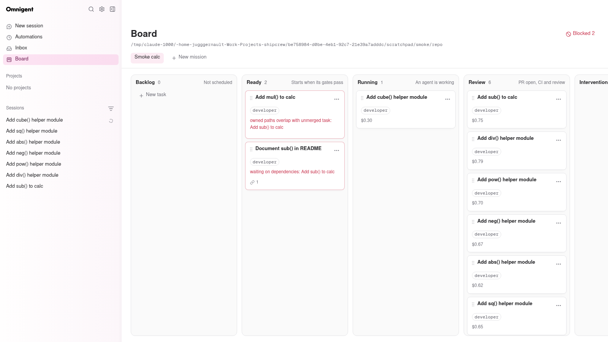
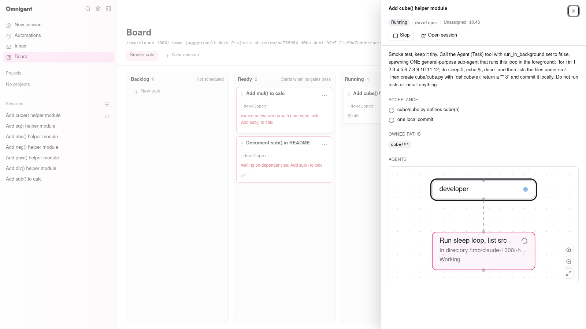

# shipcrew on omnigent: status

Branch `shipcrew` of this fork. Design: `shipcrew/PROPOSAL-v3.md`. Role bundles
live in the separate `shipcrew` repo (`agents/`, branch `v0.2`). Last live smoke
run: 2026-09-29.




## What works (verified live)

These steps ran against a real `omnigent server` + `omnigent host`, with
claude-native sessions on the Claude subscription login:

- **Board at `/board`.** It has mission tabs, six columns (Backlog, Ready,
  Running, Review, Intervention, Merged) and a Blocked filter. Drag and drop and
  keyboard moves work. It updates live from the mission SSE stream and polls
  while the stream is down.
- **Task drawer.** It shows status, role, cost, Start/Stop, the acceptance
  checklist, dependencies and owned paths. It also shows the live sub-agent tree:
  the upstream `SubagentsGraphView` over `child_sessions` of the task's root
  session. "Open session" links to `/c/{root_session_id}`.
- **Scheduler, 4 gates.** The smoke used 3 tasks: A owns `src/**`, B owns
  `src/calc.py`, and C depends on A. All three were marked ready.
  - Only A started.
  - B stayed Ready with "owned paths overlap with unmerged task".
  - C stayed Ready with "waiting on dependencies".
  - After A was marked merged, B and C both started on the next tick.

  The other two gates are capacity (`SHIPCREW_MAX_PARALLEL`) and budget
  (`SHIPCREW_MAX_USD`).
- **Task start.** It uses the bundle `<SHIPCREW_AGENTS_DIR>/<role>`, which
  defaults to `/home/jugggernault/Work/Projects/shipcrew/agents`.
  - It creates a git worktree on branch `task/<id>` and pre-seeds Claude's
    folder trust for it.
  - It creates the session with the bundle tarball, waits for the runner to be
    online, then sends the task contract as the first prompt.
  - Every task in the smoke committed its change in its own worktree.
- **Session state flows back to the card.**
  - `running`: the session is working, or it is idle while children or
    background shells are still busy.
  - `intervention`: a guardrail ASK or other elicitation is pending.
  - `review`: the turn has finished.
  - `blocked`: the session failed, or a human pressed Stop.
  - A Review card moves back to Running if its agent resumes, for example when a
    background sub-agent reports after the turn ended.
  - `cost_usd` is synced from the session. It measures how much of the
    subscription quota was used, not money spent.
- **Role bundles.** All 10 bundles (9 roles + the `shipcrew` orchestrator) pack
  through the real upload path (`materialize_bundle`, which follows the
  orchestrator's symlinks) and load through `omnigent.spec.load` with the handler
  allowlist on. `scripts/validate_agents.py` also runs 49 guardrail cases per
  bundle.

- **Worker permissions.** There is no `bypassPermissions`.
  - Each role has a shell allowlist (`omnigent/shipcrew/policies.py`,
    configured in the bundles' `_shared/policies/`). Allowlisted commands run
    with no prompt.
  - Any other command is an ASK approval card, and the card goes to
    Intervention.
  - A write outside the task's `owned_paths`, or to `package.json` or a
    lockfile that the task does not own by name, is an ASK too. Task start
    injects the owned paths and the worktree root into the bundle.
  - claude-native bundles run in Claude's `default` mode with `--allowedTools`
    set to the tools that the guardrails govern, so Claude adds no second
    prompt.
  - Verified live, 2026-09-29: see the shipcrew repo `agents/README.md`, "Live
    check".

## What is stubbed or missing

- **PR loop** (`omnigent/shipcrew/pr_loop.py`): only signatures and TODOs. This
  covers push, draft PR, the CI fix loop (up to 3 tries), the Claude reviewer
  child session, the `APPROVALS.md` policy and the serialized merge.
  - Today "Review" means the agent is idle and its work is committed locally.
  - "Merged" is set only by a human, from the menu or by dragging (with a
    confirmation).
  - Nothing is pushed.
- **Planner to board:** `.shipcrew/plan.json` (keys, then task ids) is not
  imported yet. Tasks are created by hand or through the API.
- **GitHub issues:** there is no issue sync; `issue_number` stays `null`.
  `ci` stays `none`.
- **Worktree cleanup:** worktrees stay after stop and merge. Nothing removes them
  yet.
- **Idle sessions** are not stopped when a card reaches Review. The spike found
  an idle `claude` still uses 5–25 % of a core. They are stopped (process and
  host runner, via `stop_session`) on `/stop` and when the card is moved out of
  Running/Intervention/Review.
- **ACL:** a mission and its tasks are visible to their creator only (404 for
  other users; everything is visible with auth off). There is no sharing and no
  admin override yet.
- **Sequential starts:** the scheduler starts ready cards one after the other
  (each waits for its runner, about 10 s), so N parallel starts take N times as
  long.
- **Remote hosts:** folder pre-trust only runs when the host shares the server's
  filesystem. It is skipped otherwise.

## Known issues

- **A background sub-agent looks finished.** When Claude runs the Task sub-agent
  in the background, omnigent reports the child as `completed` right away. The
  card goes to Review while the sub-agent still works, then back to Running when
  the parent resumes. A foreground Task keeps the card Running.
- **Long foreground sleeps are blocked.** Claude Code refuses a single long
  foreground `sleep`. Test prompts that need a long-running agent should loop
  short sleeps instead.
- **Board width.** At 1600 px the six columns overflow and Merged needs a
  horizontal scroll.
- **Web UI changes need a server restart.** The server caches `index.html` at
  startup, so after `pnpm --filter web build` you must restart the server.

## How to run

```bash
cd /home/jugggernault/Work/Projects/omnigent
uv sync --extra all --group dev
pnpm install --frozen-lockfile --filter web && pnpm --filter web build   # serves /board

STATE=/tmp/shipcrew-state PORT=16767                    # non-default port
scripts/shipcrew_stack.sh start "$STATE" "$PORT"          # server + host, telemetry off
# optional: SHIPCREW_MAX_PARALLEL=4 SHIPCREW_MAX_USD=100 SHIPCREW_POLL_INTERVAL_S=5
#           SHIPCREW_AGENTS_DIR=... SHIPCREW_SCHEDULER=0 (disable the loop)
xdg-open "http://127.0.0.1:$PORT/board"
scripts/shipcrew_stack.sh stop "$STATE"
```

Manual check:

1. Create a mission whose repo path is an absolute path to a git repo with a
   commit on `main`.
2. Add a task with acceptance lines and owned paths.
3. Drag the task to Ready. Within one tick it moves to Running.
4. Open the card. The drawer shows the agent tree and an "Open session" link.
5. Add a second task whose owned paths overlap the first, and drag it to Ready.
   It stays in Ready with an overlap badge until the first task is marked Merged.

API contract: `/v1/shipcrew/*`, with the same auth as the other `/v1` routes.
It is hidden from OpenAPI so the upstream `openapi.json` does not drift. The
server side is `omnigent/shipcrew/router.py` and the client side is
`web/src/board/api.ts`.

## Checks

- **Backend:**
  - `ruff check` / `ruff format --check` on `omnigent/shipcrew` and
    `tests/shipcrew`
  - `pyrefly check` (0 errors)
  - `pytest tests/shipcrew tests/server/test_shipcrew_mount.py` (117 passed)
  - `pre-commit run --files <changed>`
- **Web:**
  - `pnpm --filter web lint`
  - `pnpm --filter web type-check`
  - `pnpm --filter web build`
  - the full `vitest run` (run it on Node 26 with
    `NODE_OPTIONS=--no-experimental-webstorage LANG=C.UTF-8 TZ=UTC`)
- **Bundles:** `python3 scripts/build_agents.py --check`, and
  `uv run python <shipcrew>/scripts/validate_agents.py` run from this checkout.

## Upstream footprint (rebase surface)

- `omnigent/server/app.py`: 4 lines that call `mount_shipcrew(...)`.
- `pyproject.toml`: 1 package-data line.
- `web/src/App.tsx`: a lazy `/board` route (+5 lines).
- `web/src/shell/Sidebar.tsx`: the Board nav item (+3 lines).
- `omnigent/policies/builtins/__init__.py`: registers `omnigent.shipcrew.policies`
  in `BUILTIN_POLICY_MODULES` (+2 lines), so uploaded bundles may use the
  shipcrew guardrails.
- `omnigent/server/routes/_sessions/helpers.py`: claude-native
  `executor.config.allowed_tools` becomes the `--allowedTools` launch flag
  (+8 lines in `_derive_terminal_launch_args_from_spec`).

Everything else is new: `omnigent/shipcrew/`, its own Alembic lineage
(`shipcrew_alembic_version`), `web/src/board/`, `web/src/pages/BoardPage*`,
`scripts/shipcrew_*`, `SPIKE.md` and `docs/shipcrew/`.
