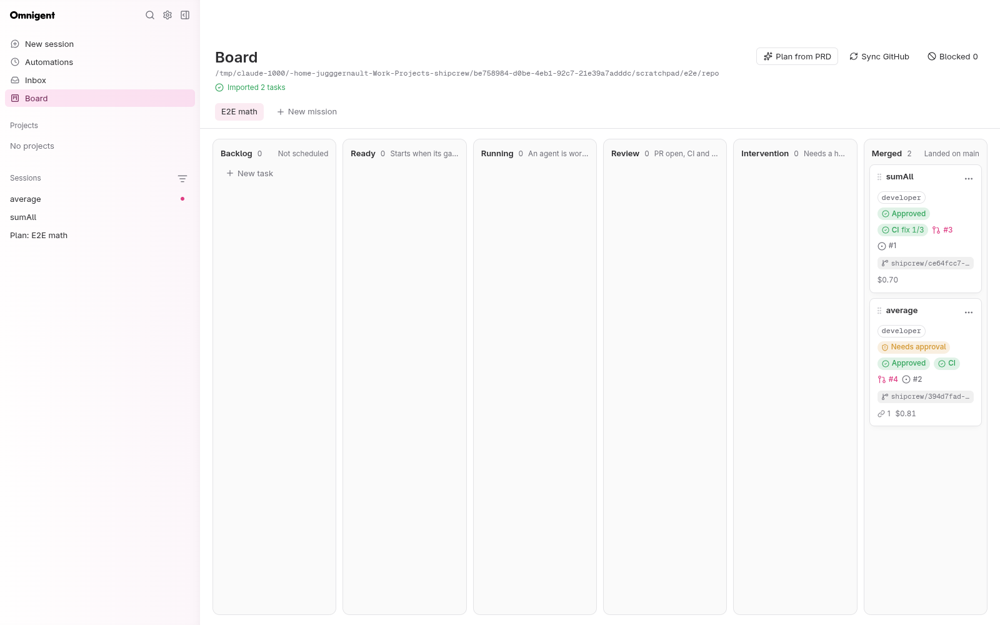
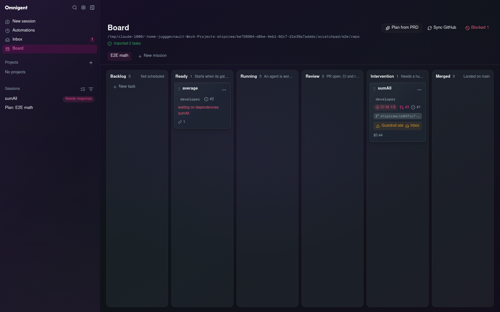
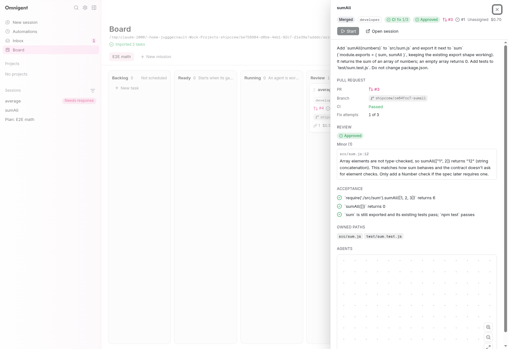
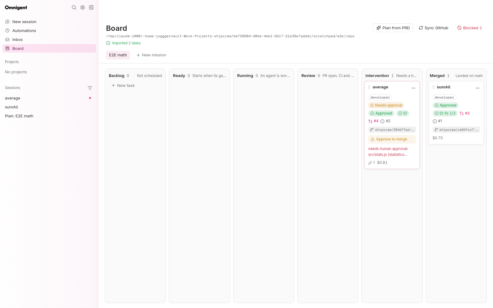
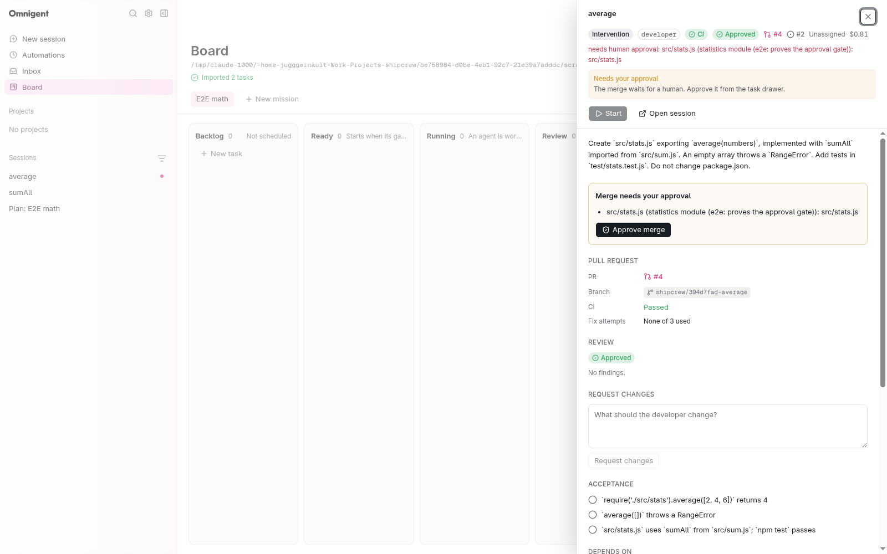

# shipcrew on omnigent: status

Branch `shipcrew` of this fork. Design: `shipcrew/PROPOSAL-v3.md`. Role bundles
live in the separate `shipcrew` repo (`agents/`, branch `v0.2`). Round 2 (PR
loop, planner import, issue sync, worker permissions, board UI) is merged. Last
live end-to-end run: 2026-09-29.







## Round 2 end-to-end (verified live, 2026-09-29)

Real `omnigent server` + `host` (`scripts/shipcrew_stack.sh`, port 16772, own
state dir), claude-native and claude-sdk sessions on the Claude subscription
login, the bundles of `shipcrew` v0.2, and `SHIPCREW_GH` pointing at the fake
gh (`scripts/shipcrew-fake-gh`). The mission repo was a throwaway CommonJS
project (`src/sum.js`, node:test tests, `"test": "node --test test/"`) whose
`origin` is a local bare repository. Nothing reached GitHub.

1. **Mission** created with `repo_url=https://github.com/shipcrew/e2e-math` so
   the issue sync runs (against the fake).
2. **`POST /missions/{id}/plan`** with a short PRD (two features, #2 depends on
   #1). The planner session wrote `.shipcrew/plan.json`; the server imported two
   developer tasks (`sumAll`, `average`), mapped `T01 -> task id` in
   `depends_on`, and set `plan.status=imported`, `imported_count=2`. The next
   sync opened issues #1 and #2 with labels `shipcrew` and `role:developer`.
3. **Both cards PATCHed to Ready.** `sumAll` started on branch
   `shipcrew/ce64fcc7-sumall` in its own worktree; `average` waited with
   "waiting on dependencies: sumAll".
4. **Developer, no prompts.** `npm test`, `git add` and `git commit` ran under
   the builder allowlist with no approval card; it ended with `PASS`.
5. **Push + draft PR.** The loop pushed to the bare remote and opened draft PR
   #3 ("Closes #1", acceptance checklist).
6. **CI red -> fix loop.** The fake CI ran `npm test` plus a hidden contract
   check (`sumAll("1,2")` must throw `TypeError("sumAll expects an array")`).
   The run was red; the loop sent the failing log to the developer as a new
   turn (`ci_attempts=1`). During that turn a chained `git fetch ...; ls
   .github/workflows` hit `shipcrew_workflows_approval`: the card went to
   **Intervention** with a "Guardrail ask" badge; it was approved through the
   elicitation resolve endpoint. The developer fixed the code and committed; the
   loop pushed the fix, CI went green.
7. **Reviewer child.** A `Review: sumAll` child session (parent = the root
   session, same worktree) got the diff snapshot and the contract, answered
   `APPROVE` with a fenced findings block (one `minor` finding, shown in the
   drawer). Its `npm test` asked on the read-only allowlist at the time; the
   reviewer now has a test-runner allowlist (shipcrew `7f10767`).
8. **Merge.** `gh pr ready`, `update-branch`, `merge --squash --delete-branch`:
   bare `main` got `sumAll (#3)`, issue #1 closed, the worktree and the local
   branch were removed, local `main` fast-forwarded, all sessions stopped.
9. **Task 2 started in the same tick** from the merged code, went through CI
   (green first time) and review (`APPROVE`, no findings), then hit the repo's
   `APPROVALS.md` rule `src/stats.js`: `needs_human_approval=true`, card in
   **Intervention** ("Needs approval"). "Approve merge" in the drawer called
   `POST /tasks/{id}/approve`; the loop squash-merged `average (#4)` within one
   tick. Final `npm test` on `main`: 6 pass, 0 fail. Both issues closed, both
   PRs merged, no worktree left.

## What works (verified by tests, and live where noted)

- **PR loop** (`omnigent/shipcrew/pr_loop.py`, live): push -> draft PR -> CI
  (3 fix turns, then Intervention) -> reviewer child (3rd `CHANGES` ->
  Intervention) -> `APPROVALS.md` gate (read from `origin/<base>`, defaults
  when absent) -> serialized squash merge (integrator child on conflict) ->
  cleanup. All state is re-read from the DB, the worktree and gh on each tick,
  so a restart resumes. `POST /tasks/{id}/approve` and
  `POST /tasks/{id}/request-changes` (tests; approve also live).
- **Planner import** (`omnigent/shipcrew/planner.py`, live): pydantic
  validation of `plan.json` (unique keys, known `depends_on`, no cycles, with a
  readable `plan.error`), one-transaction import keyed by plan key (re-import
  updates, never duplicates), `task.updated` per task then `mission.updated`.
- **GitHub issue sync** (`omnigent/shipcrew/issue_sync.py`, live against the
  fake): issue per task (labels, checklist), PR merged outside shipcrew ->
  merged, closed issue -> blocked, assignee or `shipcrew:human` -> human.
  Rate-limited per mission (`SHIPCREW_SYNC_INTERVAL_S`), no-op without
  `repo_url` or when gh is not logged in. `POST /missions/{id}/sync` returns
  the Mission plus an additive `sync` report that the board shows in its toast.
- **Worker permissions** (live, round 2 perms run and this e2e): per-role shell
  allowlists, owned-path guardrail, push guard on `shipcrew/<id8>-<slug>`, no
  `bypassPermissions`. See the shipcrew repo `agents/README.md`.
- **One branch scheme**: `omnigent/shipcrew/branches.py`
  (`shipcrew/<id[:8]>-<slug>`), stored on `Task.branch` at first start, used by
  worktrees, the loop, the issue sync and the guardrails.
- **One gh seam**: every call goes through `omnigent/shipcrew/gh.py` `_run`
  (`SHIPCREW_GH` via `tools.resolve`, bounded timeouts, `GhError`).
- **One fake gh**: `scripts/shipcrew_fake_gh.py` (+ `scripts/shipcrew-fake-gh`)
  backs the PR-loop tests, the issue-sync tests and the e2e: real pushes and
  squash merges into a local bare repo, CI = a shell command per head SHA,
  issues/labels, `--repo` on every command, `authenticated: false` for the
  not-logged-in path.
- **Board** (`web/src/board/`, live): Plan from PRD dialog and plan status,
  Sync GitHub, card badges (branch, issue, PR, CI fix n/3, review verdict,
  Needs approval, intervention reason), drawer sections (Approval, Pull request,
  Review findings, Request changes), `mission.updated` over SSE, six columns
  without horizontal scroll at 1600 px.
- **Schema**: Alembic lineage `sc0001 -> sc0002pr (PR loop) -> sc0002p (plan +
  issue sync)`, single head.
- Round 1 behaviour (board, drawer tree, 4 scheduler gates, session state ->
  card, folder pre-trust, ACL per owner) is unchanged.

## What is left / known issues

- **A reviewer or integrator ask does not move the card.** While a loop child
  waits on an approval card the task stays in Review (contract: Intervention);
  the ask only shows in the sidebar ("Needs response") and the Inbox. The
  reviewer test-runner allowlist removes the common case.
- **`workflows_approval` false positive**: a chain such as `git fetch -q
  origin; ls .github/workflows` asks, although it only reads.
- **Loop children never time out**: a reviewer, integrator or planner that
  never answers keeps the card in Review (or `plan.status=running`).
- **Transient status**: for one tick between review and the approval hold the
  card showed Running with `needs_human_approval=true`.
- **Declined asks**: an explicit `decline` interrupts the turn; the idle
  session then maps to Review, which the loop reads as "developer finished"
  (no PASS line -> blocked before a PR, or re-review after one). `cancel`
  refuses one call and lets the agent continue.
- **Drawer tree in headless Chromium**: the reviewer child node is in the React
  Flow graph (`child_sessions` returns it) but stays `visibility: hidden` in the
  DevTools browser, so the screenshots show an empty tree. Not reproduced in a
  normal browser yet.
- **Blocked filter** counts Ready cards waiting on dependencies and loop holds,
  because both carry `blocked_reason`.
- **Loop holds use a capacity slot** (intervention is an active status).
- **A card dragged to Merged by hand** skips the loop cleanup (worktree stays,
  PR stays open). The local repo keeps stale `origin/shipcrew/*` refs (fetch
  without prune).
- **Orchestrator full mode** sub-agents get no owned-paths contract (the policy
  abstains there).
- **Local filesystem assumption**: `plan.json`, worktrees and git/gh calls run
  on the server's filesystem, like folder pre-trust.
- **Real gh never exercised**: the fake mimics `--json` shapes and exit codes;
  a first run against a real repo should watch `pr checks` and `pr create`.
- **Web UI changes need a server restart** (index.html is cached).

## How to run

```bash
cd /home/jugggernault/Work/Projects/omnigent
uv sync --extra all --group dev
pnpm install --frozen-lockfile --filter web && pnpm --filter web build   # serves /board

STATE=/tmp/shipcrew-state PORT=16767                    # non-default port
scripts/shipcrew_stack.sh start "$STATE" "$PORT"          # server + host, telemetry off
# optional: SHIPCREW_MAX_PARALLEL=4 SHIPCREW_MAX_USD=100 SHIPCREW_POLL_INTERVAL_S=5
#           SHIPCREW_AGENTS_DIR=... SHIPCREW_SCHEDULER=0 (disable the loop)
xdg-open "http://127.0.0.1:$PORT/board"
scripts/shipcrew_stack.sh stop "$STATE"
```

Local PR-loop e2e with the fake gh (never touches GitHub):

```bash
E=/tmp/shipcrew-e2e; mkdir -p $E
git init -q --bare -b main $E/origin.git        # the "GitHub" repo
# clone it to $E/repo, add a tiny npm project + APPROVALS.md, push main
scripts/shipcrew_fake_gh.py init --state $E/gh.json --remote $E/origin.git \
    --repo shipcrew/e2e-math --ci-command 'npm test'
export SHIPCREW_GH=$PWD/scripts/shipcrew-fake-gh SHIPCREW_FAKE_GH_STATE=$E/gh.json
export SHIPCREW_SYNC_INTERVAL_S=10               # optional, default 60
scripts/shipcrew_stack.sh start $E/state 16772
# board: new mission (repo path $E/repo, repo URL https://github.com/shipcrew/e2e-math),
# Plan from PRD, drag the imported cards to Ready, watch them merge.
scripts/shipcrew-fake-gh pr list --state all     # or read $E/gh.json "calls"
scripts/shipcrew_stack.sh stop $E/state 16772
```

New settings: `SHIPCREW_PR_LOOP` (default on), `SHIPCREW_PR_BASE` (default
`main`), `SHIPCREW_SYNC_INTERVAL_S` (default 60, min 5), `SHIPCREW_GH`.

API contract: `/v1/shipcrew/*`, with the same auth as the other `/v1` routes.
It is hidden from OpenAPI so the upstream `openapi.json` does not drift. The
server side is `omnigent/shipcrew/router.py` and the client side is
`web/src/board/api.ts`.

## Checks (integration, 2026-09-29)

- **Backend:** `ruff check` / `ruff format --check` on `omnigent/shipcrew`,
  `tests/shipcrew`, `scripts/shipcrew_fake_gh.py`; `pyrefly check
  omnigent/shipcrew` (0 errors); `pytest tests/shipcrew
  tests/server/test_shipcrew_mount.py` plus the upstream tests next to the
  touched files (`tests/policies/test_registry.py`,
  `tests/server/routes/test_policy_registry.py`,
  `tests/server/routes/test_sessions_yolo_launch_args.py`): 376 passed;
  `pre-commit run --files <changed>`.
- **Web:** `pnpm lint`, `pnpm type-check`, `pnpm build`, and the full
  `vitest run` with `NODE_OPTIONS=--no-experimental-webstorage LANG=C.UTF-8`:
  9582 passed, 1 skipped with `--maxWorkers=4`. With the default worker count
  on this machine 5-7 upstream tests (Sidebar*, streamdownCodeHighlight) time
  out under load and pass when rerun alone.
- **Bundles:** `python3 scripts/build_agents.py --check`, and `uv run python
  <shipcrew>/scripts/validate_agents.py` run from this checkout: 10 bundles
  valid, 110 guardrail cases each.

## Upstream footprint (rebase surface)

- `omnigent/server/app.py`: 4 lines that call `mount_shipcrew(...)`.
- `pyproject.toml`: 1 package-data line.
- `web/src/App.tsx`: a lazy `/board` route (+5 lines).
- `web/src/shell/Sidebar.tsx`: the Board nav item (+3 lines).
- `omnigent/policies/builtins/__init__.py`: registers `omnigent.shipcrew.policies`
  in `BUILTIN_POLICY_MODULES` (+2 lines), so uploaded bundles may use the
  shipcrew guardrails.
- `omnigent/server/routes/_sessions/helpers.py`: claude-native
  `executor.config.allowed_tools` becomes the `--allowedTools` launch flag
  (+8 lines in `_derive_terminal_launch_args_from_spec`).

Everything else is new: `omnigent/shipcrew/`, its own Alembic lineage
(`shipcrew_alembic_version`), `web/src/board/`, `web/src/pages/BoardPage*`,
`scripts/shipcrew_*`, `SPIKE.md` and `docs/shipcrew/`.
